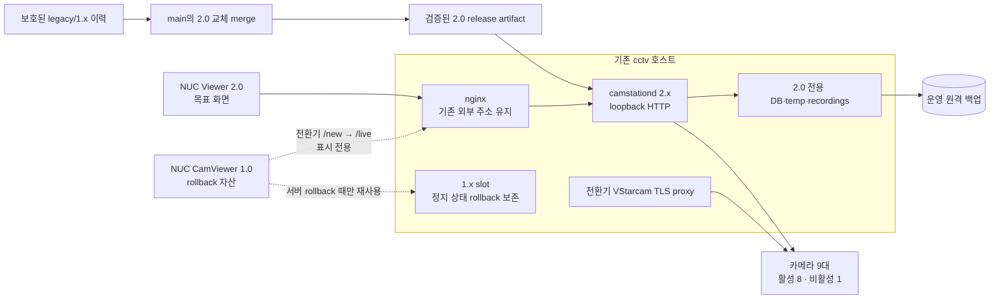

# CCTV 운영 서버 CamStation 1.x → 2.0 교체 전환 전략

> 기준일: 2026-08-09 KST
>
> 대상 운영 호스트: 기존 `cctv` 서버 (`10.0.0.26` / `192.168.0.160`)
>
> 현재 운영: `main`의 CamStation 1.x, CamViewer 1.0.4
>
> 목표: CamStation 2.0을 `main`으로 통합한 뒤 같은 서버에서 교체 운영
>
> 문서 상태: 실행 전 전략·승인 기준. 이 문서 작성 중 운영 서비스, 데이터, Viewer, Git 브랜치는 변경하지 않았다.

## 결론

권장 방식은 **소스 이력 보존형 교체 병합 + 같은 호스트의 별도 데이터 슬롯 + 단일 활성 런타임 전환**이다.

- 최종 운영 대상은 기존 `cctv` 서버다. `cctv2`는 다시 사용할 수 있을 때 사전 연습용으로만 활용하며 운영 목적지가 아니다.
- `main`과 `camstation2-initial`은 공통 조상이 없다. 일반 콘텐츠 병합을 하지 않고, 두 이력을 부모로 보존하면서 결과 트리를 검증된 2.0 트리와 정확히 일치시키는 교체형 병합을 사용한다.
- 1.x 코드·DB·녹화·nginx 설정과 Viewer 1.0 실행 자산은 전환 후 안정화 기간까지 보존한다.
- 2.0은 별도 DB, 별도 temp/recordings, 별도 서비스 단위로 준비한다. 기존 1.x DB에 2.0 마이그레이션을 직접 실행하지 않는다.
- 두 세대가 같은 go2rtc loopback 포트를 사용하므로 현재 코드 그대로는 전체 런타임을 동시에 기동할 수 없다. 코드와 데이터는 미리 준비하되 실제 영상 런타임은 승인된 정지 창에서 한 세대만 활성화한다.
- 카메라 정보는 전용 변환 도구로 가져온다. `go2rtc.yaml`이나 과거 `cctv2` DB를 운영 원본으로 복사하지 않는다.
- 서버 전환과 Windows Viewer 전환은 별도 승인 지점으로 나눈다. **서버를 먼저 2.0으로 전환하고, CamViewer 1.0을 제한된 임시 표시 셸로 사용해 서버를 검증한 뒤 Viewer 2.0을 전환**한다.
- CamViewer 1.0은 시작 주소를 `/new?viewer=1`로 고정한다. 2.0 서버에 `/new?viewer=1`을 `/live?viewer=1`로 보내는 정확한 호환 redirect를 먼저 넣지 않으면 그대로 재사용할 수 없다.
- 호환 redirect를 거친 CamViewer 1.0은 영상 표시와 수동 현장 확인에만 사용한다. 2.0 Agent·renderer·stream telemetry, 원격 재구독, 관리형 자동 업데이트를 제공하는 Viewer 2.0으로 간주하지 않는다.
- Viewer 2.0이 현장 console, telemetry, auto-start, reconnect 검증을 통과하기 전에는 CamViewer 1.0 실행 자산과 호환 redirect를 제거하지 않는다.
- 권장 유지보수 창은 2시간이다. 핵심 서비스 스위치는 더 짧게 끝낼 수 있지만, 30분 녹화 세그먼트 완료와 백업까지 확인하려면 충분한 관찰 시간이 필요하다.

현 상태로 즉시 교체하는 것은 **No-Go**다. 카메라 importer, production systemd 패키징, 운영 설정 고정, 원격 녹화 재생 정책, Viewer 실기 검증이 먼저 필요하다.

### 권장 순서 요약

| Phase | 1.x 서버 | 2.0 서버 | CamViewer 1.0 | Viewer 2.0 | 다음 단계 조건 |
| --- | --- | --- | --- | --- | --- |
| 준비 | 운영 중 | code·DB만 비활성 준비 | 운영 중 | 설치/service만 준비 | importer·build·rollback 사전 gate 통과 |
| 서버 인계 | 정상 종료·보존 | 단독 활성화 | 재실행 후 호환 bridge로 표시 | UI 미실행 | camera/live/recording 기본 gate 통과 |
| 서버 완료 판정 | 정지·rollback 대기 | 60분, rollover, backup 검증 | 표시 전용으로 수동 확인 | UI 미실행 | `9/8/1`, live 8, recorder 8, backup 8/8 |
| client 인계 | 정지·rollback 대기 | 계속 운영 | 정상 종료하되 자산 보존 | 활성 console에서 실행·검증 | telemetry·auto-start·reconnect gate 통과 |
| 안정화 | 30일 이상 보존 | 운영 | startup 중지, 7일 뒤 승인 제거 | 목표 운영 | 24시간/7일 관찰과 제거 승인 |

1.x 서버와 2.0 서버를 동시에 운영하는 단계는 없다. CamViewer 1.0을 잠시 남기는 것과 1.x backend·recorder·go2rtc를 남겨 실행하는 것은 서로 다른 결정이다.

## 확인 근거와 전환 경로

| Evidence | Finding | Path |
| --- | --- | --- |
| `git merge-base main camstation2-initial` 종료 코드 `1` | 두 브랜치는 공통 조상이 없는 별도 제품 이력이다. | 일반 merge 대신 결과 트리를 2.0으로 고정하는 교체형 merge commit을 만든다. |
| `main` 전용 165개, 2.0 전용 195개 커밋 | 1.x의 FastAPI/React와 2.0의 Go/React가 독립적으로 발전했다. | 1.x 파일과 2.0 파일을 수동 혼합하지 않는다. |
| 트리 비교: 1.x 142개 경로, 2.0 500개 경로, 공통 4개 경로 | 충돌 해소 방식의 병합은 우연한 혼합을 만들 가능성이 높다. | 병합 결과의 tree hash가 2.0 후보 tree hash와 같은지 자동 검증한다. |
| 현재 운영 점검: 카메라 9대 등록, 8대 활성·온라인, 1대 의도적 비활성 | 카메라 수와 활성 상태가 전환 불변식이다. | importer dry-run과 전환 후 API에서 `9/8/1`을 각각 확인한다. |
| 현재 운영 점검: 녹화 8개 증가, 최근 백업 392건 성공·실패 0 | 라이브 화면만 보이는 것으로 전환 성공을 판정할 수 없다. | recorder 파일 증가, 완료 세그먼트, 원격 객체, DB 백업 마커까지 확인한다. |
| NUC에서 CamViewer 1.0.4가 실제 화면을 제공하고 Viewer 2.0.20은 서비스만 실행 | 설치된 버전과 운영 중인 화면 버전이 다르다. | 1.0을 유지한 채 2.0을 구성·실행하고 현장 화면과 새 telemetry로 판정한다. |
| 1.x `viewerNavigation.ts`의 `buildViewerUrl`은 항상 `/new?viewer=1`을 생성하지만 navigation guard는 `/live`를 금지하지 않음 | 1.0 실행 파일은 2.0 live UI를 직접 선택할 수 없지만 same-origin redirect는 따라갈 수 있다. | 2.0 release에 정확한 `/new?viewer=1` → `/live?viewer=1` 호환 route와 자동 테스트를 포함한다. |
| 2.0 SPA에서 `/new`는 wildcard로 `/`에 이동하고 Viewer 전용 화면은 `/live?viewer=1`임 | redirect가 없으면 1.0 셸은 의도한 2.0 live workspace가 아니라 control-room route로 떨어진다. | “1.0을 그대로 둔다”를 무변경 호환으로 해석하지 않는다. 서버 쪽 bridge를 필수 gate로 둔다. |
| 2.0 live UI의 `window.camstationViewer` bridge는 없을 때 telemetry/control을 조용히 생략함 | 1.0 Electron 안에서도 영상 UI는 실행 가능하도록 설계됐지만 2.0 관리 상태는 생성되지 않는다. | 전환기에는 access log·API·녹화·수동 화면으로 판정하고 Viewer 관리 gate는 2.0 실행 뒤에만 적용한다. |
| 1.x와 2.0 모두 go2rtc API/RTSP 기본 포트 사용 | 같은 호스트에서 두 전체 스택의 동시 실행이 충돌한다. | 별도 파일·DB 슬롯을 사용하되 런타임은 single-active로 인계한다. |
| 2.0 기본값은 녹화 비활성, 테스트 백업 대상, 개발용 health 응답 | 개발 기본값으로 운영 기동하면 녹화·백업 누락을 초래할 수 있다. | production 환경 파일과 systemd unit을 코드와 함께 릴리스하고 설정 검증을 gate로 둔다. |
| 1.x는 원격 백업 녹화를 필요 시 내려받아 재생하지만 2.0 재생 API는 로컬 완료 파일 중심 | 과거 녹화 검색·재생 기능이 자동 승계되지 않는다. | 2.0 원격 archive 복원 기능을 구현하거나, 승인된 read-only legacy archive를 운영한다. |

운영 상태의 상세 근거는 [CCTV 운영상태 및 모니터 PC 유지보수 실행서](2026-08-09_operations-cctv-maintenance-report.md)를 기준으로 한다. 2.0 구현 현황은 [implementation status](07-implementation-status.md)와 실제 현재 소스를 함께 확인해야 한다. 상태 문서의 일부 항목은 이후 코드 구현보다 오래되었으므로 문서만으로 기능 유무를 단정하지 않는다.

## 목표 구성



외부 Viewer 주소는 현재 운영 주소인 `http://192.168.0.160`을 유지하는 것이 원칙이다. 2.0의 `18080` 포트를 NUC에 직접 노출하지 않고 nginx가 loopback의 2.0 daemon으로 전환한다. 이 방식은 Viewer 설정 변경량과 방화벽 표면을 줄인다.

## Git 통합 전략

### 일반 merge를 사용하지 않는 이유

현재 기준점은 다음과 같다.

| 항목 | 값 |
| --- | --- |
| 1.x `main` tip | `21e1e24f74b8c2b88e91f9452e0f6659cddda887` |
| 2.0 tip | `1215d0518a8e74866a5d786af865fdb4967bb18d` |
| merge-base | 없음 |
| 경로 변경 규모 | 631 files, 약 90,597 insertions / 23,445 deletions |
| 공통 경로 | 4개 |

따라서 `--allow-unrelated-histories`만 추가한 일반 merge는 같은 이름의 파일을 임의로 해결하면서 두 아키텍처를 섞을 수 있다. 목표는 1.x 코드를 2.0 코드 안에 합성하는 것이 아니라, **1.x 이력을 보존한 채 제품 트리를 2.0으로 교체**하는 것이다.

### 권장 통합 절차

현재 변경이 있는 작업 디렉터리에서 실행하지 않는다. 별도의 깨끗한 worktree 또는 clone에서 다음 절차를 수행한다.

```bash
git fetch --prune origin
git switch -c release/camstation-2.0-main-cutover origin/main
git merge --no-commit --allow-unrelated-histories -s ours origin/camstation2-initial
git read-tree --reset -u origin/camstation2-initial
git commit -m "release: replace CamStation 1.x with 2.0"
test "$(git rev-parse 'HEAD^{tree}')" = "$(git rev-parse 'origin/camstation2-initial^{tree}')"
git show -s --format='%H%n%P%n%T' HEAD
```

`git read-tree --reset -u`는 해당 worktree의 index와 파일을 교체하므로 **전용 clean worktree에서만** 사용한다. 위 절차는 임시 clone으로 모의 실행했고, merge commit이 1.x와 2.0 두 부모를 가지면서 결과 tree가 2.0 tree `01a825c67d451e12803c0a3565a056db59a34965`와 일치함을 확인했다.

병합 전에 다음 보호 지점을 만든다.

- `legacy/1.x` 보호 브랜치: 최종 1.x 운영 hotfix용
- `legacy-1x-final-YYYYMMDD` 서명 tag: 실제 전환 직전 1.x 기준점
- `camstation-2x-rc-YYYYMMDD` 서명 tag: 빌드·테스트한 2.0 후보
- release manifest: commit, source tree, Go binary, web assets, Viewer MSI의 SHA-256와 빌드 시각

병합 PR은 다음 조건을 모두 만족해야 한다.

1. 결과 tree가 승인된 2.0 후보와 정확히 같다.
2. 1.x 파일을 수동으로 되살린 예외가 없다.
3. 전체 Go·Web·Viewer 테스트, lint, production build가 깨끗한 후보에서 통과한다.
4. 이 문서에서 요구한 importer와 production 배포 파일이 2.0 후보 안에 포함된다.
5. runtime rollback은 `legacy/1.x`를 사용하며, 장애가 났다고 `main`을 즉시 force-push하지 않는다.

## 데이터 전환 계약

2.0 SQLite DB는 새로 생성하고, 1.x snapshot을 읽는 **idempotent importer**가 도메인 규칙에 따라 채운다. 기존 DB 파일에 2.0 스키마를 직접 적용하거나 테이블을 통째로 복사하지 않는다.

### 카메라와 레이아웃

| 1.x source | 2.0 target | 변환 규칙 |
| --- | --- | --- |
| `cameras.id` | `cameras.stream_name`, `layout_key` | 문자열을 그대로 보존한다. 신규 숫자 PK는 2.0이 생성한다. |
| `display_name` | `cameras.name` | 표시명과 새 녹화 archive label에 사용한다. |
| `enabled`, `archived_at` | `enabled`와 import 정책 | 활성 8대만 true. `소방서2`는 반드시 false. archived 항목은 별도 manifest에 보존하고 자동 활성화하지 않는다. |
| main stream | recording input stream | credential을 포함한 값은 secret로만 옮기며 출력·로그·문서에는 redacted 값만 남긴다. |
| sub stream | live input stream | 없으면 명시적 recording-source fallback 정책을 생성한다. |
| ONVIF host/port/account | camera control target와 secret-bearing canonical URL | RTSP 계정과 ONVIF 계정이 다른 카메라는 별도 표현 또는 schema 보강 없이는 합치지 않는다. dry-run이 이를 차단해야 한다. |
| `sort_order` | insert order 또는 신규 metadata | 2.0에 동등 필드가 없으므로 현재 순서를 보존해 insert한다. 값이 운영에 중요하면 전환 전에 2.0 schema/UI를 보강한다. |
| `location`, `notes` | 신규 metadata 또는 migration archive | 비어 있지 않은 값이 있으면 무시하지 말고 schema 보강 또는 승인된 read-only archive 중 하나를 선택한다. |
| layout item `i` | stable `streamName` | 카메라 key가 일치하지 않으면 import를 실패시킨다. |
| layout 12/48-column 좌표 | 2.0 48-column layout | 저장된 `grid_cols`를 기준으로 정규화하고 겹침·범위·누락을 검사한다. 영상 wheel zoom 값은 존재할 때만 보존한다. |

각 카메라는 다음 2.0 구조를 갖는다.

- stable camera key: 기존 `id`
- recording input: 기존 main stream
- live input: 기존 sub stream 또는 승인된 fallback
- outputs: recording, live, focus 세 개
- camera policy state: desired/applied revision과 적용 결과
- enabled state: 1.x 값과 동일

`go2rtc.yaml`은 DB로부터 다시 생성되는 파생물이다. 1.x YAML은 DB에 빠진 값이 있는지 비교하는 보조 증거로만 사용한다. 과거 `cctv2`의 2.0 DB도 profile/policy 참고 자료일 뿐이며, 운영 credential이나 enabled 상태의 원본이 아니다.

### 설정·녹화·백업·Viewer

| 영역 | 전환 정책 |
| --- | --- |
| 녹화 설정 | 운영의 30분 segment를 명시적으로 설정한다. 개발 script 기본값 5분을 사용하지 않는다. |
| 녹화 자동 시작 | production unit에 `recording-enabled=true`를 명시한다. 첫 영상 smoke 단계만 false로 시작한 뒤 승인 후 true로 재기동한다. |
| 용량 정리 | 초기 전환에는 자동 용량 정리를 0으로 두고 `protectUnbacked=true`를 강제한다. 백업 검증 후 별도 용량 한도를 승인한다. |
| 보존·motion | retention은 변환 가능하지만 1.x motion threshold/enabled와 2.0 기능은 동등하지 않다. motion 기능이 운영 필수이면 구현 전까지 No-Go다. |
| 백업 | 운영 remote target을 root 전용 설정에서 가져와 2.0 settings에 명시한다. 소스의 테스트 기본 target은 금지한다. `rclone` credential은 복사본이나 Git에 넣지 않는다. |
| 로컬 녹화 | 2.0은 별도 recordings root에 새 파일을 쓴다. 1.x 로컬 파일은 rollback 기간 동안 이동·삭제하지 않는다. |
| 과거 녹화 DB | 약 9.2 TB의 논리 이력을 2.0 active DB에 무조건 복사하지 않는다. 원격 객체와 매칭되는 index만 변환하거나 legacy archive DB를 read-only로 보존한다. |
| 원격 재생 | 1.x의 on-demand remote download와 동등한 2.0 기능 또는 별도 read-only archive UI가 승인되어야 한다. 과거 재생이 필요 없다는 명시적 운영 승인 없이는 생략하지 않는다. |
| Viewer registry | 1.x `viewer_clients`와 command queue를 가져오지 않는다. 2.0 Viewer가 새 ID/heartbeat로 등록한다. |
| stale Viewer 명령 | 기존 pending/claimed 명령을 2.0으로 옮기지 않는다. 1.0 agent도 명령 만료 전에는 복구하지 않는다. |
| 임시 Viewer 1.0 셸 | 저장된 서버 base URL은 유지하고 `/new?viewer=1` 호환 redirect로 2.0 live UI만 표시한다. 이 단계에서는 Viewer registry·heartbeat·원격 명령·2.0 자동 업데이트를 기대하지 않는다. |
| Viewer 설정 | NUC의 2.0 server URL을 기존 운영 주소로 바꾸고 auto-start를 활성화한다. GUI 실행·영상 판정은 활성 콘솔에서 수행한다. |

### importer 필수 동작

구현할 migration command는 다음 계약을 만족해야 한다.

1. `inspect`: schema version, row count, nonempty optional fields, 중복 key, secret 형식만 읽어 redacted manifest를 만든다.
2. `dry-run`: 대상 DB를 쓰지 않고 카메라·stream·output·layout·settings 변환 결과와 차단 사유를 JSON으로 낸다.
3. `import`: 빈 2.0 DB에 한 transaction으로 적용한다. 실패하면 전부 rollback한다.
4. `verify`: source와 target을 secret 제외 manifest로 비교한다.
5. `idempotency`: 같은 입력으로 두 번째 실행했을 때 생성·변경 건수가 0이어야 한다.
6. `nonempty guard`: 대상 DB에 운영 데이터가 있으면 명시적 승인 없이 덮어쓰지 않는다.
7. `secret hygiene`: stdout, event, error, JSON manifest에 raw URL·계정·token을 기록하지 않는다.

최소 불변식은 다음과 같다.

```text
registered cameras = 9
enabled cameras = 8
disabled cameras = 1
disabled key = 소방서2
stable streamName unique = 9
enabled cameras with recording output = 8
enabled cameras with live output or approved fallback = 8
each imported camera outputs = recording + live + focus
layout camera keys outside registry = 0
raw secrets in migration evidence = 0
```

## 같은 서버 배포 설계

### 슬롯과 서비스 경계

서버의 실제 절대 경로는 root 전용 deployment manifest에 기록하고 Git 문서에는 credential이나 민감한 runtime path를 넣지 않는다. 논리 경계는 다음과 같다.

| 논리 자산 | 원칙 |
| --- | --- |
| `LEGACY_SLOT` | 현재 1.x 코드, venv, DB, nginx 원본, Viewer 1.0 배포물을 변경 없이 보존 |
| `RELEASE_2X` | commit별 불변 release 디렉터리와 원자적 `current` pointer |
| `STATE_2X` | DB, generated go2rtc config, quarantine, diagnostics, Viewer release를 code와 분리 |
| `TEMP_2X` / `RECORDINGS_2X` | 1.x 녹화와 다른 하위 root 사용; rollback 시 2.0 창의 영상도 보존 |
| `camstationd-2x.service` | 제안된 production systemd unit; loopback HTTP, 명시적 env, cgroup 전체 종료 |
| nginx | 외부 주소는 유지하고 upstream만 1.x ↔ 2.0으로 전환 |
| VStarcam TLS proxy | 두 해당 카메라의 2.0 direct `rtsps`가 장시간 검증될 때까지 전환기 dependency로 유지 |

production unit은 최소한 다음을 보장해야 한다.

- `CAMSTATION_ADDR=127.0.0.1:18080`
- DB/temp/recordings/Viewer release의 명시적 persistent 경로
- `CAMSTATION_RECORDING_ENABLED=true`와 `CAMSTATION_SEGMENT_MINUTES=30`
- 개발용 `CAMSTATION_MAX_STORAGE_GB=0.30` 미사용
- 전용 service account와 recordings/rclone에 필요한 최소 권한
- `Restart=on-failure`, 적절한 startup timeout, `KillMode=control-group`
- stdout/stderr의 systemd journal 수집과 secret redaction
- go2rtc API/RTSP/WebRTC listener의 loopback 유지
- 2.0 service stop 후 managed go2rtc와 ffmpeg가 남지 않는 검증
- 전환 성공 시 legacy 세 유닛 disable·2.0 enable, rollback 시 그 반대의 boot 소유권 복원

현재 [daemon composition](../cmd/camstationd/main.go)은 go2rtc 설정 위치 일부를 working directory의 `./data`로 사용한다. production unit의 `WorkingDirectory`는 release code가 아니라 persistent state root로 고정해야 release 교체 때 DB·generated config가 이동하지 않는다.

### nginx 전환

1.x upstream과 2.0 upstream을 각각 독립된 include로 준비한다. 활성 include만 원자적으로 바꾸고 다음 순서로 적용한다.

유지보수 창 전에 `prepare-nginx.sh`로 검토된 1.x site hash를 확인하고, 중복으로 활성화된
backup server block을 root 전용 보존 경로로 이동한 뒤 `active-backend`가 legacy include를
가리키는 상태로 무중단 reload한다. 이 사전 단계는 upstream을 바꾸지 않으며 실패하면 원래
site와 중복 block을 즉시 복원한다.

1. 새 설정 파일을 lint한다.
2. loopback 2.0에서 `/api/health`, `/api/system/status`, `/api/cameras`, `/player/` WebSocket을 확인한다.
3. `nginx -t` 성공 후 reload한다.
4. 외부 운영 주소에서 API, SPA, WebSocket 101을 확인한다.
5. 실패하면 include를 1.x로 되돌리고 다시 `nginx -t` 후 reload한다.

2.0의 현재 `/api/health`는 `ok=true`, `mode=development`를 반환하므로 단독 readiness 신호로 쓰지 않는다. go2rtc, camera, recorder, backup을 묶은 별도 acceptance check가 필요하다.

### CamViewer 1.0 임시 호환 bridge

CamViewer 1.0을 서버 전환기의 표시 셸로 쓰려면 2.0 release에 다음 계약을 가진 **버전 관리되는 서버 route**를 포함하는 방식을 권장한다. nginx query 분기보다 애플리케이션 route가 자동 테스트와 제거 시점을 함께 관리하기 쉽다.

```text
request:  GET /new?viewer=1
response: 302 또는 307
Location: /live?viewer=1
scope:    same-origin의 정확한 legacy Viewer 진입점만 허용
```

- `/new`의 다른 query나 일반 운영자 요청을 Viewer 호환으로 넓히지 않는다. 조건이 맞지 않으면 현재 2.0 기본 route인 `/`로 보낸다.
- redirect 응답과 최종 `/live?viewer=1` 응답을 자동 route test로 고정하고, 실제 NUC에서는 nginx access log의 두 요청과 현장 화면을 함께 증거로 남긴다.
- 1.0의 navigation guard는 `/live`를 제한하지 않으므로 same-origin redirect를 막지 않는다. 앱을 다시 시작할 때마다 고정 `/new?viewer=1`로 시작한 뒤 bridge를 다시 통과한다.
- 기존 1.0 UI JavaScript가 이미 메모리에 올라온 상태에서는 새 서버로 upstream만 바꿔도 화면이 자동 교체되지 않는다. nginx 전환 뒤 CamViewer 1.0을 **정상 종료 후 다시 실행**해 2.0 자산을 새로 받아야 한다.
- 1.0 설정 화면의 연결 검사는 legacy `/api/status`를 사용하고 updater는 legacy `/api/settings/viewer-*`를 사용한다. 2.0 API 계약과 다르므로 이 기능들의 성공 여부를 전환 판정에 쓰거나 1.0에서 server URL을 다시 저장하지 않는다. updater의 파싱 실패는 현재 코드상 조용히 무시되며 2.0 Viewer 설치 경로가 아니다.

이 bridge에서 보장하는 것은 **2.0 웹 live 화면의 렌더링과 재생 가능성**뿐이다. 1.0 preload에는 2.0의 `window.camstationViewer` bridge가 없고, 기존 1.x heartbeat/command 처리는 1.x 서버가 내려준 과거 웹 코드에 들어 있다. 따라서 2.0 UI를 띄운 1.0 셸에는 다음 제한이 있다.

- 2.0 Viewer Agent/control/renderer/stream telemetry 없음
- 서버의 Viewer 목록에서 정상 관리 단말로 판정 불가
- 원격 stream resubscribe와 관리형 Viewer update 불가
- 영상 상태 판정은 현장 화면, 2.0 camera API, WebSocket/access log, recorder 증거로 대체

호환 bridge는 Viewer 2.0 전환 실패 때 사용하는 **client-only rollback**이기도 하다. Viewer 2.0이 안정화된 뒤 CamViewer 1.0 startup을 끄고, 정해진 보존 기간이 끝났을 때 bridge와 1.0 실행 자산을 함께 정리한다.

### 2026-08-09 준비 구현 현황

호환 route, 한글 stable key, SQLite online snapshot/import/verify, production-safe backup
기본값, systemd/nginx packaging, preflight/switch/rollback helper가 구현됐다. 검증된
`2.0.0-rc.20260809.5` release, inactive unit, 온라인 snapshot, 이관 DB와 legacy-active nginx
include 구조가 운영 서버에 설치됐고 전체 preflight가 통과했다. 1.x는 계속 active이며 2.0은
inactive/disabled, switch approval은 `NO`다. 자세한 통과·미통과 항목은
[전환 준비도 보고서](2026-08-09_cctv-2x-cutover-readiness-report.md)에 기록한다.

실제 DB 검증에서 세 `sub_stream_url` 값이 카메라 endpoint가 아니라 loopback go2rtc ffmpeg
recipe로 확인됐다. importer는 이 exact self-key H.264 형식을 별도 input으로 복사하지 않고
recording input 기반 live output으로 변환한다. 또한 state는 전용 state root에, recording과
temp는 같은 대용량 media filesystem에 두도록 production contract를 고정했다.

읽기 전용 운영 재확인 결과 1.x의 backend, backup, 별도 go2rtc가 활성 상태이고
1984/8554/8555를 사용하며 18080은 비어 있다. 따라서 “2.0 실행 후 1.0 종료”는 프로세스
순서로는 불가능하다. **2.0 설치·DB 이관 후, maintenance 상태에서 1.x 세 유닛을 정확히
정지하고 포트 해제를 확인한 다음 2.0을 실행**하는 순서로 해석한다. nginx와 VStarcam TLS
proxy는 이 handoff 동안 유지한다.

## 실행 단계

### 단계 0 — Release 준비와 No-Go 해소

- 교체형 merge를 별도 integration branch에서 만들고 PR 검토한다.
- production systemd unit, nginx include, deployment/rollback script를 추가한다.
- importer와 redacted manifest 검증을 구현한다.
- `/new?viewer=1`을 `/live?viewer=1`로 보내는 제한된 호환 route와 route test를 2.0 release에 추가한다.
- 과거 원격 녹화 재생 방식을 구현하거나 운영자가 read-only legacy archive 방식을 승인한다.
- 운영 backup target, schedule, segment, storage 정책을 명시한다.
- 2.0 Viewer MSI의 version, SHA-256, signer, 서버 API compatibility를 release manifest에 고정한다.
- 가능하면 `cctv2`를 복구해 같은 9-camera manifest 또는 안전한 subset으로 full rehearsal한다. 재현되지 않으면 production window와 rollback 기준을 더 보수적으로 잡는다.
- 깨끗한 release 후보에서 전체 test/lint/build를 실행한다.

2026-08-09 현재 작업 트리에서 `scripts/test-dev.sh`의 Go 전체 테스트, Web 52개, Viewer 23개는 통과했다. 이는 소스 기준선일 뿐 production build, Linux 서비스, 실제 Windows GUI, 실제 카메라 전환 증거를 대신하지 않는다.

### 단계 1 — T-24시간 사전 준비

- 현재 1.x app version, service 상태, nginx config hash, DB quick-check, 카메라 `9/8/1`, recorder 8개 증가, remote backup 최신성을 KST로 기록한다.
- online SQLite backup을 만들고 원본과 snapshot hash를 별도 기록한다.
- camera/settings/layout의 redacted source manifest를 만든다.
- 최종 2.0 release와 empty target DB를 서버의 비활성 슬롯에 배치한다.
- snapshot으로 importer dry-run, import, verify, second-run idempotency를 수행한다.
- 2.0 DB와 release의 소유권·ACL을 점검한다.
- production service와 nginx include는 설치하되 disabled/inactive로 둔다.
- loopback과 staging HTTP에서 legacy Viewer 호환 redirect와 최종 `/live?viewer=1` 응답을 확인한다.
- NUC의 Viewer 1.0 실행 상태와 Viewer 2.0 service 상태를 다시 확인한다. 이때 Viewer를 바꾸거나 1.0 agent를 살리지 않고, 1.0의 저장된 server base URL도 변경하지 않는다.

### 단계 2 — T0 freeze와 최종 snapshot

1. 운영자에게 maintenance 시작을 알리고 카메라·layout·settings 변경을 금지한다.
2. 1.x가 계속 실행 중인 상태에서 내장 SQLite online backup으로 최종 불변 snapshot을 만든다.
3. 최종 snapshot으로 새 비활성 2.0 DB를 생성·import·verify한다. 기존 다른 target은 덮어쓰지 않는다.
4. preflight에서 active 1.x와 snapshot의 camera/layout/settings canonical fingerprint가 같은지 다시 확인한다.
5. 마지막 완료 1.x 파일의 backup 업로드·DB mark가 최신인지 확인한다. 종료 순간 열린 segment는 1.x local rollback 자산에 남는다는 점을 기록한다.
6. nginx를 maintenance 응답으로 전환해 신규 쓰기와 Viewer 재접속을 차단한다.
7. `camstation-backend`, `camstation-backup`, `go2rtc`를 exact systemd unit으로 정상 정지한다.
8. recorder/keepalive 종료와 1984/8554/8555 해제를 확인한다. 전환기 TLS proxy는 유지한다.

서비스를 강제 종료하거나 broad PID 명령을 사용하지 않는다. 각 세대의 systemd/lifecycle 명령만 사용한다.

### 단계 3 — 2.0 서버 기동

1. `CAMSTATION_RECORDING_ENABLED=true`, 30분 segment, 700GB 한도를 명시하고 backup만 안전하게 비활성화한 2.0 service를 시작한다.
2. loopback API에서 DB, camera `9/8/1`, 세 개 output, policy applied 상태를 확인한다.
3. 활성 8대의 go2rtc input과 public live output을 순차적으로 probe한다.
4. recorder 8개가 local go2rtc RTSP input을 사용하고 10초 이상 파일 크기가 증가하는지 확인한다.
5. nginx active include를 2.0으로 전환하고 외부 운영 주소의 UI/API/WebSocket을 확인한다.
6. CamViewer 1.0을 정상 종료 후 다시 실행해 access log에서 `/new?viewer=1` redirect와 `/live?viewer=1` 도착을 확인한다.
7. 현장 화면에서 활성 8대가 표시되고 `소방서2`가 제외되는지 확인한다. 이때 Viewer telemetry가 없는 것은 예상된 제한이며 영상 검증을 생략하는 근거가 아니다.
8. 30분 rollover 후 8개 완료 파일이 DB `ready`이고 ffprobe로 재생 가능한지 확인한다.
9. 운영 backup target을 설정하고 한 번 수동 실행해 원격 8개, DB mark 8개, 로컬 정리 정책을 확인한 뒤 schedule을 활성화한다.

활성 8대 중 하나라도 import에서 빠지거나, 비활성 `소방서2`가 자동 활성화되면 즉시 No-Go다.

### 단계 4 — 서버 전환 완료 판정

이 단계까지는 Viewer 2.0 UI를 실행하지 않는다. CamViewer 1.0은 2.0 서버의 화면 확인용으로만 유지한다.

1. 최소 60분 동안 5분 간격으로 camera API, go2rtc output, recorder 8개, error log, CPU/memory/disk를 확인한다.
2. 최소 한 번의 30분 rollover와 운영 remote로의 backup·DB mark 성공을 확인한다.
3. CamViewer 1.0 화면은 시작, focus 전환, 전체 grid 재생, 잠깐의 네트워크 단절 뒤 회복을 수동 확인한다.
4. 서버 판정표에 camera `9/8/1`, live `8`, recorder `8`, rollover `8`, backup `8/8`, crash loop `0`을 KST 시각과 함께 기록한다.
5. 위 항목이 모두 통과하면 **서버 전환 완료**를 선언하고 다음의 독립된 client 변경으로 넘어간다.

이 단계의 1.0 셸은 heartbeat나 2.0 renderer telemetry를 보내지 않으므로 그 신호를 기다리지 않는다. 반대로 수동 화면과 서버 증거 중 하나라도 실패하면 Viewer 2.0 전환으로 장애를 덮지 말고 서버 rollback을 수행한다.

### 단계 5 — NUC Viewer 2.0 전환

서버의 외부 2.0 검증이 끝난 뒤에만 수행한다.

1. CamViewer 1.0 UI를 정상 종료하되 설치 파일과 startup 자산은 남긴다.
2. Viewer 2.0 management service에 기존 운영 주소, 승인된 display name, `autoStart=true`를 저장한다.
3. Viewer 2.0은 `dyllislev`의 활성 console/AnyDesk 세션에서 직접 실행한다. SSH에서 프로세스가 보인다는 사실은 화면 증거가 아니다.
4. `/live?viewer=1`에서 활성 카메라 8대가 실제로 재생되고 1대 비활성이 표시 대상에서 제외되는지 현장 확인한다.
5. 서버 Viewer registry에서 Agent, control, Viewer, renderer, stream progress가 모두 최신인지 확인한다.
6. focus, wheel zoom/pan, saved layout, fullscreen, 연결 끊김 후 재접속을 확인한다.
7. 한 번의 승인된 logoff/logon 또는 reboot 후 auto-start와 8-stream 복귀를 확인한다.

1.x의 과거 pending/claimed command는 2.0 DB로 옮기지 않는다. runtime rollback 시에도 오래된 command를 먼저 만료하지 않고 1.0 agent를 재시작해서는 안 된다.

Viewer 2.0만 실패하고 단계 4의 서버 gate가 계속 정상이면 서버를 되돌리지 않는다. Viewer 2.0 UI와 auto-start만 중지하고 CamViewer 1.0을 호환 bridge로 다시 실행하는 client-only rollback을 사용한다.

### 단계 6 — 안정화와 종료

- Viewer 2.0 전환 뒤 최초 60분 동안 5분 간격으로 camera, recorder, Viewer telemetry, error log, CPU/memory/disk를 확인한다.
- 24시간 동안 각 활성 카메라의 예상 segment 수, backup 성공/실패, 원격 객체 수, Viewer reconnect를 비교한다.
- Viewer 2.0의 첫 정상 logon/reboot 복귀 뒤 CamViewer 1.0 startup은 비활성화하되 실행 자산과 호환 bridge는 7일 동안 보존한다.
- 7일 안정화와 두 번 이상의 성공한 backup cycle 뒤 별도 승인으로 CamViewer 1.0 실행 자산과 호환 bridge를 함께 제거한다.
- 1.x 코드·DB·configuration snapshot은 최소 30일 또는 두 번의 정기 유지보수 주기 중 더 긴 기간 보존한다.
- 삭제는 별도 승인 작업으로 수행하고, 삭제 대상과 복구 가능 여부를 다시 확인한다.

## Go/No-Go 기준

| Gate | Go 증거 | No-Go 예시 |
| --- | --- | --- |
| G0 Git | 두 parent, 승인된 2.0 tree hash 일치, 보호 tag/branch | merge-base 오인, 혼합 tree, dirty worktree에서 생성 |
| G1 Build | Go/Web/Viewer test·lint·production build PASS, artifact hash 고정 | 생성 asset 불일치, 테스트 실패, 재현 불가 artifact |
| G2 Import | `9/8/1`, unique keys, outputs 3개씩, layout keys 0 orphan, second run 0 change | 카메라 누락, 비활성 자동 활성화, secret 출력 |
| G3 Runtime | go2rtc와 8 live output 정상, crash loop 0 | 충돌 포트, 1대 이상 지속 누락, raw go2rtc 외부 노출 |
| G4 Legacy shell | 정확한 redirect 1회, `/live?viewer=1` 도착, 현장 화면 8대; telemetry 없음이 명시됨 | `/` 또는 과거 `/new` 화면, redirect loop, 검은 화면, telemetry를 거짓 정상 처리 |
| G5 Recording | recorder 8개 증가, 8개 rollover ready/playable | worker 누락, temp 고착, file/DB 불일치 |
| G6 Backup | 운영 target 확인, remote 8개, mark 8개, 실패 0, unbacked 보호 | 테스트 target, 원격 수 불일치, mark 전 로컬 삭제 |
| G7 Viewer 2.0 | 현장 화면 8대, fresh Agent/control/renderer/stream telemetry, auto-start 복귀 | SSH-only 판정, 검은 화면, stale heartbeat |
| G8 Rollback | 1.x server 복구와 client-only 복구 rehearsal, 설정/hash 보존 | legacy DB 변경, 서비스/포트 충돌, 복구 절차 미검증 |
| G9 Archive | 과거 녹화 재생 경로 검증 또는 명시적 운영 예외 승인 | 기능이 사라졌지만 미고지 |

다음 중 하나면 관찰을 계속하지 말고 rollback을 시작한다.

- 활성 카메라가 2회 연속 검사에서 8대 미만
- recorder가 한 camera라도 두 번 연속 증가하지 않거나 첫 rollover가 누락
- backup 대상이 운영 remote와 다르거나 upload/mark/delete 순서가 깨짐
- 단계 4에서 CamViewer 1.0을 재실행한 뒤 2분 안에 2.0 live 화면과 8대 재생을 회복하지 못함
- 단계 5에서 Viewer 2.0 현장 화면과 Agent/control/renderer/stream telemetry가 불일치함. 단, 이 경우 서버 gate가 정상이면 client-only rollback을 먼저 수행함
- DB quick-check 실패, 반복 lock/5xx, go2rtc/camstationd crash loop
- raw camera credential이나 runtime secret가 API·로그·진단 파일에 노출
- 1.x rollback asset의 hash/DB snapshot이 예상과 다름

## Rollback 절차

rollback은 Git `main`을 되돌리는 작업과 운영 런타임을 복구하는 작업을 구분한다. 운영 장애 시 우선 runtime만 1.x로 복구한다.

### 서버 rollback — 단계 2~4의 서버 gate 실패

1. KST 장애 시각, 실패 gate, 2.0 release hash를 기록하고 redacted diagnostics를 보존한다.
2. nginx를 maintenance 응답으로 바꾼다.
3. `camstationd-2x.service`를 정지하고 그 cgroup의 go2rtc/ffmpeg가 모두 종료됐는지 확인한다.
4. 2.0 DB와 2.0 recordings를 그대로 보존한다. 2.0 운영 창에 생성된 영상을 삭제하지 않는다.
5. nginx upstream을 1.x로 되돌리고 설정 검사를 통과시킨다.
6. 전환기 TLS proxy, 1.x go2rtc, 1.x backend, 1.x backup 순으로 관리 서비스에서 복구한다.
7. 1.x camera 8대, recorder 8개 파일 증가, backup 최신성을 확인한다.
8. 실행 중인 Viewer 2.0 UI가 있으면 종료하고 auto-start를 끈 뒤 기존 CamViewer 1.0 UI만 활성 console에서 정상 재실행한다.
9. 1.0 control agent는 stale command 만료 전에는 시작하지 않는다.
10. nginx maintenance를 해제하고 사용자에게 복구 완료와 보존된 2.0 데이터 위치를 알린다.

nginx가 1.x upstream으로 돌아가면 2.0의 호환 route도 함께 사라진다. CamViewer 1.0은 다시 자신의 원래 `/new?viewer=1` 1.x 화면을 받으므로 NUC server URL을 되돌려 쓸 필요가 없다.

### client-only rollback — 단계 5의 Viewer 2.0만 실패

1. 단계 4의 server gate가 여전히 정상인지 camera, recorder, backup으로 다시 확인한다.
2. Viewer 2.0 diagnostics와 현장 증거를 보존하고 UI를 정상 종료한다.
3. Viewer 2.0 auto-start를 비활성화하되 service·installer·설정은 분석을 위해 보존한다.
4. CamViewer 1.0을 활성 console에서 다시 실행하고 호환 redirect 및 8대 화면을 확인한다.
5. 서버 2.0, nginx upstream, 2.0 DB와 녹화는 변경하지 않는다.
6. client 수정 일정을 별도로 잡고, Viewer 2.0 gate를 다시 통과한 뒤에만 1.0 정리를 재개한다.

2.0 창에서 이미 원격으로 올라간 파일은 rollback 뒤 삭제하지 않는다. 별도 reconciliation에서 중복 여부와 camera/time 범위를 확인한다.

## 실행 전 남은 승인 사항

다음 항목은 실제 전환 예약 전에 확정해야 한다.

1. **과거 녹화 접근**: 권장은 2.0 remote archive 재생 기능 구현이다. 차선은 1.x archive DB/UI의 read-only 유지다.
2. **Viewer artifact**: NUC에 설치된 2.0.20을 그대로 쓸지, `main` release와 함께 만든 새 MSI로 교체할지 hash/API compatibility로 결정한다.
3. **MSI 서명**: production Authenticode 서명을 완료하거나 내부 unsigned 운영 위험을 명시적으로 승인한다.
4. **motion/alert parity**: 현재 사용 여부를 확인해 필수이면 2.0 구현 후 진행하고, 아니면 기능 제외를 기록한다.
5. **cctv2 rehearsal**: 장비를 복구할 수 있으면 production 전에 전체 절차를 한 번 수행한다. 복구할 수 없으면 2시간 창과 즉시 rollback 인력을 확보한다.
6. **전환 일시와 현장 확인자**: NUC 화면을 볼 수 있는 console/AnyDesk 승인자를 지정한다.
7. **임시 호환 기간**: 서버 완료 판정에 사용할 60분 관찰, CamViewer 1.0 자산과 `/new` bridge의 7일 보존, 제거 승인자를 확정한다.

## 유지보수 산출물

전환 완료 후 다음 redacted 문서를 남긴다.

- Git release manifest와 두 branch/tag의 commit/tree hash
- importer source/target manifest와 불변식 결과
- production unit/nginx 설정의 secret 제외 hash
- 카메라·recorder·backup·Viewer acceptance summary
- CamViewer 1.0 호환 redirect/access-log 증거, 표시 전용 제한의 운영 인수, 제거 시각
- KST 전환 timeline과 rollback 여부
- Viewer MSI version/SHA/signer와 NUC install evidence
- 1.x rollback snapshot 보존 기한과 삭제 승인자
- known deviations와 다음 유지보수 시 점검 항목

원문 DB, raw camera URL, 계정, webhook, `rclone` credential, Viewer token, SSH private key는 Git이나 유지보수 문서에 넣지 않는다.

## 관련 문서와 코드

- [운영 상태 및 접근 실행서](2026-08-09_operations-cctv-maintenance-report.md)
- [2.0 전환 준비도 보고서](2026-08-09_cctv-2x-cutover-readiness-report.md)
- [현 1.x 구조에서 확인된 문제](01-current-system-findings.md)
- [2.0 architecture](03-camstationd-architecture.md)
- [cctv2 실카메라 테스트 계획](04-cctv2-test-plan.md)
- [2.0 구현 상태](07-implementation-status.md)
- [2.0 daemon composition](../cmd/camstationd/main.go)
- [2.0 SQLite schema](../internal/store/schema.go)
- [2.0 camera store](../internal/store/cameras.go)
- [2.0 recorder](../internal/recorder/recorder.go)
- [2.0 backup runner](../internal/backup/runner.go)
- [1.x snapshot/import command](../cmd/camstation-migrate/main.go)
- [production staging/switch/rollback helpers](../scripts/production/)
- [2.0 Viewer console configuration helper](../scripts/windows/Invoke-CamStationViewerConsoleLaunch.ps1)
- [2.0 SPA routes](../web/src/app/App.tsx)
- [2.0 Viewer mode routes](../web/src/app/viewerMode.ts)
- [2.0 optional Viewer preload bridge](../web/src/components/live/viewerBridge.ts)
