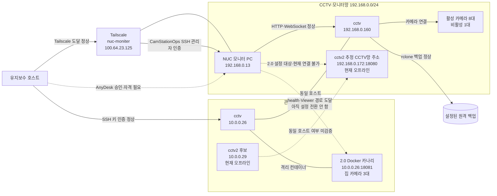

# CCTV 운영상태 및 모니터 PC 유지보수 실행서

> 점검 기준 시각: 2026-08-10 06:03 KST
> 대상: 현 운영 CCTV 서버, CamStation 2.0 후보, 모니터 PC `192.168.0.13`
> 점검 방식: 승인된 내부 자산에 대한 저속 확인과 운영자 승인 공개키 등록
> 증거 인덱스: [Evidence index](../work/20260809-cctv-operations/evidence/INDEX.md)
> 원본 증거는 민감한 운영 자료이므로 Git에 넣지 않고, 유지보수 워크스페이스의 무시된
> `work/20260809-cctv-operations/` 아래에만 보존한다. 위 링크는 해당 워크스페이스에서만 유효하다.

## 먼저 확인할 사항

현재 영상 모니터링과 녹화·백업은 정상 동작하고, 모니터 PC의 관리자 SSH 제어도 준비됐다. 다만 다음 항목을 지키지 않으면 현재 1.0 화면을 중단시킬 수 있다.

1. 모니터 PC의 Viewer 제어 에이전트를 재시작하기 전에 서버에 쌓인 오래된 명령 10개를 검토·만료 처리해야 한다. 그대로 에이전트가 살아나면 `restart_app` 5건, `reload_page` 4건, `ping` 1건이 오래된 순서대로 실행될 수 있다.
2. 화면에서 실제 운영 중인 앱은 Camviewer 1.0.4다. Viewer 2.0.20의 MSI 설치 구성은 정상으로 확인됐지만, 대화형 프로세스가 없고 자동시작이 꺼져 있으며 설정된 과거 서버도 응답하지 않는다. 설치 정상과 전환 완료는 다르므로 아직 1.0을 제거하면 안 된다.
3. `CamStationOps` 관리자 SSH는 공개키로 검증됐지만 모니터 PC에서는 설치 유지보수만
   수행한다. Viewer 개발과 GUI 검증은 `WIN11-DELL`에서 일회성 대화형 캡처 하네스를
   사용하며, 모니터 PC에 VNC·AnyDesk 같은 별도 제어 서비스를 추가하지 않는다.

## 빠른 결론

| 항목 | 현재 상태 | 판정 |
| --- | --- | --- |
| 운영 서버 | `cctv`; 관리망 `10.0.0.26`, CCTV망 `192.168.0.160`인 동일 호스트 | 정상 |
| CamStation 2.0 후보 | 문서상 `cctv2` 관리주소 `10.0.0.29`; Viewer 설정주소 `192.168.0.172:18080` | 둘 다 오프라인, 동일 호스트 추정 미검증 |
| Docker 2.0 카나리 | `10.0.0.26:18081`; 집 카메라 3대만 활성 | health 정상, NUC 도달 정상 |
| 2.0 카나리 녹화 정리 | 완료 영상 1,632개·9,245,386,547바이트 삭제; 기준점 완료 파일 0·활성 temp 3 | 완료, 녹화는 계속 활성 |
| 핵심 서비스 | backend, backup, go2rtc, nginx, 카메라 TLS proxy 모두 active/running | 정상 |
| 카메라 | 9대 등록, 8대 활성·온라인, `소방서2` 1대 비활성 | 정상/의도된 비활성 |
| 녹화 | 8개 recorder 파일 모두 최종 10초 카메라별 관찰 동안 증가 | 정상 |
| 백업 | 24시간 392건 성공, 실패 0; 원격 최근 2시간 32개 확인 | 정상 |
| 데이터베이스 | quick-check `ok`; 잠금 재시도 10건은 복구됨 | 정상, 경고 있음 |
| 모니터 UI | `192.168.0.13`의 Camviewer 1.0.4가 현재도 요청·WebSocket 사용 | 정상 |
| Viewer 2.0 | MSI 2.0.20 소유 파일 76/76 존재·크기 일치, 관리 서비스 정상; 화면 미실행·자동시작 꺼짐 | 설치 정상, 전환 대기 |
| Viewer 제어 에이전트 | 마지막 heartbeat 2026-07-01 07:34:23 KST | 장애 |
| 모니터 원격관리 | Tailscale SSH `CamStationOps` 관리자 키 인증 검증; AnyDesk는 승인 필요 | CLI 제어 가능, GUI 승인 필요 |
| 보안 경계 | HTTP/SSH 전 인터페이스 노출, 앱 인증 없음, root/password SSH 허용, UFW 비활성 | 개선 필요 |

## 확인된 구성



현재 8대 운영 영상과 녹화의 기준선은 기존 CamStation 1.0이다. 같은 `cctv` 호스트에는 별도 포트·상태로 격리된 2.0 Docker 카나리가 추가됐고, 중복 접속이 허용된 집 카메라 3대만 포함한다. NUC에서 카나리 health와 Viewer 경로에 도달할 수 있지만 2.0 Viewer 설정은 아직 바꾸지 않았다.

카나리 재시작 여부는 Docker의 `StartedAt`, `RestartCount`, OOM·health 상태로 판정한다. 현재 `/api/health.startedAt`은 요청 시각을 반환하므로 프로세스 uptime으로 사용하면 안 된다. 최종 확인에서 컨테이너는 health 정상, restart count 0, OOM 없음이었다.

### 2.0 카나리 녹화 정리

2026-08-10 06:03 KST 기준으로 Docker 2.0 카나리의 **완료 녹화만** 삭제했다. Docker
inspect로 state `/var/lib/camstation2-canary/data`와 media
`/mnt/hdd/camstation2-canary`를 확인해 1.0 경계와 분리했고, 삭제 전 DB `ready` 1,623행과
실제 MP4 1,623개·9,193,448,264바이트가 누락·크기 불일치·추가 파일 없이 일치했다.
카메라별 최신 완료본도 약 60초 H.264/AAC MP4로 확인했다.

삭제는 재귀 파일 명령이 아니라 CamStation의 안전한 세그먼트 DELETE API로 exact ID
snapshot만 처리했다. 녹화가 계속되는 동안 새로 완료된 9개까지 두 번의 추가 guard로
정리해 총 **1,632개, 9,245,386,547바이트**를 삭제했다. 최종 checkpoint는 DB `ready` 0,
물리 완료 파일 0, 삭제 중간파일 0, 작성 중 temp 3개였다. 세 temp 파일은 10초 표본에서
모두 증가했고 recorder 3개·카메라 3대·컨테이너 health/restart 0 및 1.0의 기존 5개 unit
PID/restart 0이 유지됐다. 추가 10초 표본에서도 1.0의 열린 MP4 8개가 모두 같은 inode를
유지하며 증가했다.

삭제본은 모두 `backup_state=pending`이고 백업 완료 시각이 없으며 휴지통/격리본도 만들지
않았다. 따라서 CamStation으로 복구할 수 없다. 감사용 DB 행은 `deleted`로 남는다. 녹화
기능은 끄지 않았으므로 이 checkpoint 이후 새 1분 파일은 다시 생성된다. 상세 내역은
[E-020](../work/20260809-cctv-operations/evidence/E-020.md)과
[Docker 카나리 운영 문서](2026-08-09_camstation2-docker-canary-operations.md)에 있다.

과거 개발 서버 후보도 구분해서 보존한다. 사용자는 `.172`가 기존 `cctv2`일 가능성이 높다고 확인했지만 저장된 기록은 `cctv2=10.0.0.29`만 명시하며 둘 다 현재 오프라인이다. 이 호스트를 다시 사용할 때만 hostname, 인터페이스, SSH host key를 교차 검증한다. 현재 클라이언트 선시험 대상은 이 과거 후보가 아니라 `10.0.0.26:18081` 카나리다.

## 서버 운영상태

### 시스템과 버전

| 구성요소 | 확인값 |
| --- | --- |
| OS | Ubuntu 24.04.3 LTS |
| Kernel | 6.8.12-8-pve |
| Python | 3.12.3 |
| 운영 앱 | `v20260704-21e1e24` |
| go2rtc | 1.9.14 |
| ffmpeg | 6.1.1 |
| nginx | 1.24.0 |
| rclone | 1.60.1-DEV |

점검 시 NTP는 동기화되어 있었고 시스템 상태는 `running`이었다. 약 9.9일 동안 가동 중이었으며 핵심 서비스의 systemd 재시작 횟수는 모두 0이었다. 메모리는 약 1.1 GiB/8 GiB, 루트 파일시스템은 약 13%, 녹화 파일시스템은 약 2 GiB/984 GiB를 사용했다.

내부 backend와 go2rtc 리스너는 loopback에만 묶여 있다. 외부에는 nginx HTTP와 SSH가 노출된다.

### 카메라와 녹화

활성·온라인 카메라는 다음 8대다.

- `집-마당`
- `집-창고1`
- `집-창고2`
- `소방서1`
- `소방서3`
- `소방서4`
- `소방서5`
- `염소장`

`소방서2`는 설정상 비활성이며 마지막 녹화는 2026-06-13 KST다. 이를 장애로 간주해 자동 재활성화하지 않는다.

프로세스 구성은 recorder 8개, sub-stream keepalive 8개, go2rtc transcode 2개로 총 ffmpeg 18개다. 최종 카메라별 10초 관찰에서 8개의 활성 녹화 파일이 모두 동일 inode를 유지하며 0.75~2.5 MiB 증가했고, 각 활성 카메라는 최근 24시간 48~49개의 30분 세그먼트를 생성했다. 3초처럼 지나치게 짧은 표본은 write-buffer flush 때문에 일시적으로 증가가 안 보일 수 있으므로 정상 판정에 사용하지 않는다.

최근 24시간 go2rtc에는 17건의 일시적 timeout/EOF 경고가 있었지만 현재 카메라 8대는 모두 복구되어 온라인이다. 새 경고가 지속되면서 해당 카메라의 파일 증가가 멈출 때만 실제 장애로 승격한다.

### 백업과 보존

현재 경로는 다음과 같이 동작한다.

1. recorder가 임시 세그먼트를 기록한다.
2. 완료 세그먼트를 백업 watcher가 감지한다.
3. rclone 업로드 성공 후 DB의 `backed_up` 표시를 갱신한다.
4. 표시 성공 후 로컬 완료 파일을 삭제한다.

최근 24시간에는 업로드·표시·로컬 삭제가 각각 392건 모두 성공했고, 실패나 DB 표시 실패는 없었다. 원격 저장소에도 최근 2시간 기준 32개, 약 8.94 GB가 확인되어 8대 × 4개 30분 세그먼트와 일치했다.

주의할 점은 `/api/recordings/stats`의 약 9.2 TB 값이 현재 로컬 사용량이 아니라 DB에 남은 역사적 논리 합계라는 것이다. 용량 경보에는 파일시스템 사용량을 사용한다.

### 현재 알려진 서버 문제

| 우선순위 | 문제 | 영향 | 현재 조치 |
| --- | --- | --- | --- |
| P1 | Viewer 1.0 제어 heartbeat 39.3일 정지 | 원격 reload/restart 불가, `healthy` 표시 오판 | 오래된 명령 만료 후 1.0 agent 복구 또는 2.0 전환 중 하나만 선택 |
| P1 | HTTP 관리 API 무인증·평문, SSH root/password 허용, UFW 비활성 | 내부망 장비 침해 시 관리권 탈취 가능 | 별도 변경계획으로 인증·방화벽·SSH 강화 |
| P2 | 2026-07-30의 stale open segment 7개 | 하루 2,016건 세부 오류와 288건 요약 오류 | DB 백업 후 정확한 7행만 정리 |
| P2 | 2026-06-14 이전 `backed_up=0` 역사 데이터 | 백업 완전성·용량 UI 왜곡 | 원격 목록과 별도 reconciliation |
| P2 | 24시간 SQLite lock 재시도 10건 | 현재는 자동 복구, 5xx 없음 | 5xx 또는 retry 고갈 시 P1로 승격 |

## 모니터 PC 운영상태

### 실제 동작 여부

모니터 PC는 꺼져 있지 않다. CCTV 서버의 nginx 기록에서 `192.168.0.13`은 최근 24시간 31,715건, 최근 15분 331건을 전송했고 마지막 요청은 2026-08-09 14:58:02 KST였다. User-Agent는 Windows의 `camviewer/1.0.4`, Electron 31.7.7이며 결과는 200 또는 WebSocket 101이었다.

Windows 관리자 SSH로 직접 확인한 결과도 같다. `dyllislev`의 활성 콘솔 세션에서 데스크톱의 CamViewer 1.0.4 본 프로세스와 Electron 자식 프로세스들이 실행 중이며 사용자 시작프로그램에 1.0 항목이 있다. 따라서 화면 앱은 동작하지만, 별도 Viewer heartbeat/명령 에이전트는 멈춘 상태다. DB에 저장된 `healthy 8/8`은 2026-07-01의 마지막 값을 그대로 보여 주므로 실시간 건강판정으로 사용하면 안 된다.

Viewer 2.0.20 MSI와 `CamStationViewerService`는 이미 설치되어 자동 서비스로 실행 중이다. 그러나 대화형 2.0 Viewer 프로세스는 없고, 2.0 설정의 `autoStart`는 `false`이며 대상 `192.168.0.172:18080`도 연결되지 않는다. 반면 NUC에서 현재 Docker 카나리 `10.0.0.26:18081`의 health와 웹 경로는 정상 응답한다. 이는 정상 설치된 전환 대기 상태이지 운영 전환 완료가 아니다.

### Viewer 2.0 설치 무결성 판정

| 점검면 | 확인 결과 |
| --- | --- |
| Windows Installer | CamStation Viewer 2.0.20, 제품 상태 5(설치됨), 캐시 MSI 존재 |
| MSI 소유 파일 | 76/76 존재, 누락 0, 예상 크기 불일치 0 |
| 핵심 파일 | Viewer·서비스·MSI SHA-256을 [E-018](../work/20260809-cctv-operations/evidence/E-018.md)에 기록 |
| 서비스 | LocalSystem, 자동 시작, Running, exit code 0, 실패 시 재시작 복구 설정 |
| 시작 경로 | HKLM Run과 공용 바탕화면·시작 메뉴 바로가기가 현재 Viewer 실행 파일을 직접 가리킴 |
| 권한 | 설치·상태 디렉터리와 Viewer 레지스트리는 일반 사용자 읽기 전용, SYSTEM·Administrators만 쓰기 가능 |
| 서명·출처 | MSI, 설치 래퍼, Viewer, 서비스에 내장 Authenticode 서명 없음; 서버의 배포 메타데이터도 없어 독립 출처 대조 불가 |
| 비소유 잔여물 | Program Files에 이전 bootstrap 계열 파일 2개, ProgramData에 비활성 updater/state 약 385 MB; 실행 중인 구성요소는 없음 |
| 현재 연결 | 과거 `.172:18080` 설정·자동시작 `false`; 카나리에는 아직 Viewer 등록 0건 |

결론은 **재설치가 필요한 손상 상태가 아니라, 개발용 2.0.20이 정상 설치됐지만 전환 설정과 화면 수락을 하지 않은 상태**다. 78개가 보인다는 이유만으로 설치 오류로 판단하면 안 된다. 그중 76개가 현재 MSI 소유 파일이고 나머지 2개는 이전 설치 세대의 비활성 잔여물이다. 최종 운영 배포에는 서명되고 배포 hash가 확인되는 패키지를 사용해야 하며, 잔여물 정리는 1.0 rollback 보존 기간이 끝난 뒤 별도 승인으로 수행한다.

### Viewer MSI 로컬 빌드 경계

저장소에는 전용 Windows x64 개발 PC 또는 VM에서 실행하는 MSI 빌드 진입점을 추가했다.

```powershell
pwsh -NoProfile -File .\scripts\build-viewer-msi.ps1 `
  -Version 2.0.21 `
  -UnsignedDevelopment
```

이 명령은 Viewer 테스트·Electron Windows 패키징·버전이 삽입된 Go 서비스·새 WiX 파일
fragment·WiX MSI를 격리 작업공간에서 만들고, MSI 내부 제품명·버전·ProductCode·고정
UpgradeCode·File table 수와 SHA-256·unsigned 상태를 확인한 뒤 MSI, WiX symbol, hash 파일,
비밀정보 없는 build metadata를 게시하도록 구성했다. 설치 명령과 NUC 주소는 포함하지 않는다.
자세한 준비·산출물·오류 대응은 [MSI 빌드 안내](../installer/README.md)에 있다.

현재 작업 호스트는 Linux이며 Windows VM/image가 없으므로 **실제 2.0.21 MSI는 아직 생성되지
않았다**. Linux에서 4개 빌드 정책 테스트, 전체 Viewer 29개 테스트, TypeScript 빌드,
Windows Electron 패키징, Go 서비스 테스트, PowerShell 7.5 구문분석과 비-Windows 차단까지
통과했다. 실제 WiX 빌드와 MSI DB 검사는 전용 Windows 호스트에서 실행해야 한다. NUC에
잠시 두었던 SDK·빌드 입력은 제거됐으며 NUC는 검증된 완성 MSI의 설치·복구·제거만 담당한다.
근거와 미완료 gate는 [E-019](../work/20260809-cctv-operations/evidence/E-019.md)에 기록했다.

### 장비 식별값

| 항목 | 값 |
| --- | --- |
| Windows hostname | `NUC` |
| CCTV망 주소 | `192.168.0.13` |
| Tailscale 이름 | `nuc-moniter` |
| Tailscale 주소 | `100.64.23.125` |
| 현재 운영 Viewer | Camviewer 1.0.4 |
| 병행 설치 Viewer | CamStation Viewer 2.0.20, MSI 파일 완전·서비스 실행·화면 미실행 |
| SSH | OpenSSH for Windows 9.5, Tailscale에서만 접근 가능 |
| GUI 원격제어 | AnyDesk Client, TCP 7070 |
| RDP / WinRM | 현재 닫힘 |

Tailscale ping은 `nuc-moniter`를 `192.168.0.13` 경유로 약 2 ms에 직접 도달했다. LAN 주소와 Tailscale 주소의 AnyDesk 인증서 fingerprint도 동일하여 같은 PC임을 확인했다.

검증용 fingerprint:

| 대상 | SHA-256 fingerprint |
| --- | --- |
| CCTV 서버 SSH host key | `MaQyesqTifCWVoNssV+NZvQ8Lww6UQss+Vl0lKAk8T8` |
| NUC Windows SSH host key | `2To+PAyHxNGbCYqH86Bk7zzwsJXrEnPDZQsuGNyQHy0` |
| NUC AnyDesk TLS certificate | `70:2A:85:4A:10:0C:AE:41:64:F8:CE:87:E6:73:1C:91:FF:8F:9E:3E:66:E2:6E:9B:55:C6:0C:3A:DD:FF:30:B3` |
| 현재 유지보수 공개키 | `a2KEW5wXBPtkTNI2R9SHbflQ1yFwcFKIfewEwdHfea4` |

fingerprint가 바뀌면 접속을 계속하지 말고 콘솔에서 재확인한다.

### 접근 방법과 현재 권한

| 방법 | 용도 | 인증 | 현재 결과 |
| --- | --- | --- | --- |
| `ssh cctv` | 서버 CLI·서비스·로그·DB 점검 | 기존 Ed25519 key | root 접속 가능 |
| AnyDesk → NUC | Windows GUI, UAC, Viewer 화면·앱 복구 | 사용자 승인 또는 password-manager의 무인접속 정보 | 서비스 도달 확인, 자격 미제공 |
| Tailscale SSH → NUC | Windows 관리자 CLI·서비스·작업 스케줄러 점검 | 전용 `CamStationOps` 공개키 | `nuc\camstationops`, 관리자 token 검증 완료 |
| Tailscale SMB/RPC | 보조 파일/관리 경로 | Windows 자격 | 포트 도달, 사용하지 않음 |
| RDP / WinRM | Windows GUI/PowerShell | Windows 자격 | 현재 미사용·포트 닫힘 |
| CamStation Viewer commands | ping/reload/restart | Viewer agent heartbeat | 에이전트 stale로 사용 불가 |

대화형 콘솔 사용자는 `dyllislev`이며 현재 Administrators 구성원으로 확인됐다. SSH 설정은 `AllowUsers CamStationOps`로 제한되어 있으므로 유지보수는 별도 로컬 관리자 `CamStationOps`로 수행한다. 전용 공개키 등록 후 host key를 고정한 비대화형 로그인과 관리자 token을 검증했다. `dyllislev`를 SSH 허용 목록에 추가하지 않았고 password 인증도 사용하지 않았다.

## 정기 점검 절차

### 1. 서버 식별과 핵심 서비스

유지보수 호스트에서 실행한다.

```bash
ssh-keygen -F 10.0.0.26
ssh -o BatchMode=yes -o StrictHostKeyChecking=yes cctv '
  hostname
  systemctl is-system-running
  for unit in camstation-backend camstation-backup go2rtc nginx vstarcam-tls-proxy; do
    printf "%s\t" "$unit"
    systemctl is-active "$unit"
  done
  printf "ffmpeg\t"
  pgrep -xc ffmpeg
  df -h /
'
```

정상 기준은 hostname `cctv`, system `running`, 5개 unit `active`, ffmpeg 18개다. ffmpeg 개수만으로 녹화를 단정하지 말고 다음 API와 파일 증가 확인을 함께 수행한다.

### 2. 안전한 API 상태 확인

```bash
curl --fail --silent --show-error http://10.0.0.26/api/system/health
curl --fail --silent --show-error http://10.0.0.26/api/status
curl --fail --silent --show-error http://10.0.0.26/api/cameras/config
curl --fail --silent --show-error http://10.0.0.26/api/recordings/stats
```

다음 표면은 점검에 사용하지 않는다.

- raw go2rtc API: 원본 카메라 접속정보가 노출될 수 있다.
- camera-admin 원본 응답: 카메라 URL·계정정보를 포함할 수 있다.
- 상태 변경 POST/PATCH/DELETE: 승인된 변경창과 rollback이 없으면 실행하지 않는다.

### 3. 녹화와 백업

다음 조건을 모두 만족해야 정상이다.

- 활성 카메라 수와 recorder 수가 각각 8이다.
- 각 활성 파일의 크기가 카메라별 10초 관찰 간격에 증가한다.
- 최근 30분 세그먼트가 DB에 나타난다.
- backup watcher가 active다.
- 최근 업로드 성공 수와 DB 표시·로컬 삭제 수가 일치한다.
- 원격 최근 개수가 예상치와 일치한다. 30분 세그먼트라면 2시간 기준 8대 × 4개 = 32개가 기준이다.

백업 서비스는 주 로그를 systemd journal이 아닌 전용 파일에 기록한다. 경로는 서버에서 service `ExecStart`가 가리키는 스크립트의 `LOG=` 설정으로 확인하고, 로그 원문을 티켓이나 Git에 붙이지 않는다.

### 4. 모니터 PC 존재와 UI 확인

```bash
tailscale ping -c 2 nuc-moniter
target=100.64.23.125
for port in 22 445 7070; do
  timeout 3 bash -c "</dev/tcp/$target/$port" 2>/dev/null &&
    printf 'TCP/%s open\n' "$port"
done
```

정상 기준:

- Tailscale ping이 `192.168.0.13` 직접 경로 또는 정상 relay로 응답한다.
- TCP 22와 7070이 열린다.
- 서버에서 최신 `192.168.0.13` Viewer 요청이 1분 이내에 보인다.
- Viewer heartbeat는 60초 이내여야 한다. 현재는 이 기준을 충족하지 못한다.

### 5. Windows 인증 후 읽기 전용 인벤토리

등록된 `CamStationOps` SSH로 접속한 뒤 다음을 먼저 실행한다. 어떤 서비스도 즉시 재시작하지 않는다.

```powershell
whoami
hostname
Get-ComputerInfo | Select-Object WindowsProductName, WindowsVersion, OsBuildNumber
Get-NetIPAddress -AddressFamily IPv4 | Select-Object InterfaceAlias, IPAddress
Get-Service | Where-Object {
  $_.Name -match 'ssh|anydesk|cam|viewer' -or
  $_.DisplayName -match 'AnyDesk|CamStation|Viewer'
} | Select-Object Name, DisplayName, Status, StartType
Get-ScheduledTask | Where-Object {
  $_.TaskName -match 'CamStation|Viewer'
} | Select-Object TaskName, State, TaskPath
Get-CimInstance Win32_Process | Where-Object {
  $_.Name -match 'camviewer|electron|camstation'
} | Select-Object ProcessId, Name, SessionId
```

GUI가 필요한 화면 상태, UAC, AnyDesk 승인, Viewer 창 확인은 SSH 결과만으로 정상 판정하지 않는다.

## 등록 완료된 접근권한 사용

2026-08-09 KST에 운영자가 관리자 PowerShell에서 기존 `AllowUsers CamStationOps` 정책을 유지한 채 전용 유지보수 공개키를 등록했다. 기존 authorized keys는 보존됐고 timestamped backup이 만들어졌다. 관리자 키 파일 ACL은 SYSTEM과 BUILTIN\Administrators만 남았으며 개인키와 암호는 Windows로 복사하지 않았다.

접속 시 다음 host key와 사용자 이름을 고정한다.

```bash
ssh-keyscan -T 5 -t ed25519 100.64.23.125 2>/dev/null | ssh-keygen -lf -
ssh -i /root/.ssh/id_ed25519 \
  -o IdentitiesOnly=yes \
  -o BatchMode=yes \
  -o PreferredAuthentications=publickey \
  -o PasswordAuthentication=no \
  -o KbdInteractiveAuthentication=no \
  -o StrictHostKeyChecking=yes \
  -o UserKnownHostsFile=work/20260809-cctv-operations/evidence/nuc_known_hosts \
  CamStationOps@100.64.23.125 whoami
```

정상 결과는 NUC host fingerprint `2To+PAyHxNGbCYqH86Bk7zzwsJXrEnPDZQsuGNyQHy0`와 `nuc\camstationops`다. fingerprint가 바뀌거나 password prompt가 나오면 접속을 중단한다. 키 폐기 시에는 현장 콘솔을 먼저 확보하고, 다른 기존 키를 보존한 채 fingerprint `a2KEW5wXBPtkTNI2R9SHbflQ1yFwcFKIfewEwdHfea4`인 한 줄만 승인된 변경으로 제거한다.

AnyDesk 장치 식별자와 무인접속 정책은 조직 password manager에만 저장한다. OpenReverse와 AnyDesk 클라이언트가 없는 headless 유지보수 호스트에서는 GUI 자동화를 시도하지 않는다.

## 1.0에서 2.0으로 안전하게 전환

현재 기준선은 다음과 같다.

| 표면 | 확인 상태 |
| --- | --- |
| 1.0 화면 | `dyllislev` 콘솔에서 Camviewer 1.0.4 실행 중 |
| 1.0 자동시작 | 사용자 시작프로그램 항목 존재 |
| 2.0 설치 | CamStation Viewer 2.0.20 MSI 등록 완료 |
| 2.0 관리 서비스 | `CamStationViewerService` 자동·실행 중 |
| 2.0 화면 | 대화형 프로세스 없음 |
| 2.0 자동시작 설정 | `false` |
| 2.0 서버 설정 | `192.168.0.172:18080`, 현재 연결 불가 |
| 현재 선시험 서버 | `http://10.0.0.26:18081`, NUC에서 health·Viewer 경로 정상 |
| 현재 카나리 범위 | 집 카메라 3대만 활성, Viewer 등록 0건 |
| 설치 패키지 승인 | 파일 배치 정상이나 unsigned 개발 빌드; 최종 운영용 서명 패키지 필요 |

전환 순서는 다음과 같다.

1. 현장/AnyDesk 운영자가 현재 1.0 화면과 8대 재생을 확인하고 변경 시작을 알린다. 1.0 실행 파일과 시작프로그램은 그대로 둔다.
2. NUC에서 `http://10.0.0.26:18081/api/health`와 `/viewer`가 응답하고, 서버의 Viewer 등록 목록이 시험 전 비어 있는지 확인한다.
3. `dyllislev` 대화형 세션에서 2.0 설정 화면을 열어 서버 주소만 `http://10.0.0.26:18081`로 저장한다. 첫 선시험에는 자동시작을 계속 끈다. 레지스트리를 직접 편집하지 않고 서비스 IPC를 사용하는 Viewer 설정 화면으로 변경한다.
4. 1.0을 닫지 않은 상태에서 2.0 Viewer를 실행한다. 30초 안에 새 Viewer 등록·heartbeat, version 2.0.20, Viewer `running`, renderer `ready`를 확인한다.
5. 카나리 범위인 집 카메라 3대가 실제 화면에서 재생되고 current-time이 진행하는지 10분 이상 확인한다. 이 단계는 2.0 클라이언트 선시험일 뿐 8대 최종 수락이 아니다.
6. 선시험 성공 후에도 1.0 자동시작은 유지한다. 서버 최종 전환으로 전체 8대가 2.0에서 수락된 변경창에만 2.0 자동시작을 켜고 1.0 자동시작을 비활성화한다.
7. 서명된 운영 패키지·전체 8대·재로그인 또는 재부팅 자동복구를 검증한 뒤에만 1.0 제거와 잔여 파일 정리를 별도 승인한다.

선시험 실패 시 2.0 자동시작을 계속 끈 상태로 2.0 화면만 닫는다. 계속 실행 중인 Camviewer 1.0.4의 기존 `192.168.0.160` 서버 HTTP/WebSocket과 8대 화면을 확인한다. 검증 중에는 2.0 MSI를 제거하거나 1.0 파일을 덮어쓰지 않는다.

## Viewer 에이전트 복구 순서

이 절차는 2.0 전환이 아니라 **1.0을 계속 운영하기로 결정한 경우에만** 수행한다. 현재 화면 앱은 살아 있으므로 무계획 재부팅이나 전체 프로세스 종료는 금지한다.

1. 서버 DB를 일관된 방식으로 백업한다.
2. `viewer_commands`의 pending/claimed 항목을 읽기 전용으로 목록화한다. `GET .../commands/pending`는 조회와 동시에 가장 오래된 명령을 `claimed`로 바꾸므로 점검용으로 호출하지 않는다.
3. 현재 확인된 오래된 pending 10건과 claimed 4건의 ID·명령·시각을 검토한다.
4. 별도 승인된 변경으로 오래된 pending/claimed만 `failed/expired` 처리한다. 새 명령이나 다른 Viewer 행이 포함되면 rollback한다.
5. AnyDesk로 Viewer 화면이 실제 재생 중인지 확인하고 유지보수 시작을 알린다.
6. Windows에서 Viewer UI가 아니라 정확한 1.0 heartbeat/command agent 서비스 또는 작업만 재시작한다. `CamStationViewerService`는 설치된 2.0 구성요소이므로 1.0 agent로 오인하지 않는다.
7. 60초 이내에 새 heartbeat가 도착하고, `last_seen`이 현재 KST이며, expected/healthy가 8/8인지 확인한다.
8. 새 `ping` 1건만 발행하여 completed 되는지 확인한다.
9. stale heartbeat 알람이 사라지고 Viewer 화면·WebSocket이 유지되는지 10분 관찰한다.

정확한 1.0 agent service/task 이름은 아직 확정되지 않았다. 이름을 추측해 `taskkill`, `Stop-Process`, 전체 CamViewer 종료를 실행하지 않는다.

## 서버 데이터 정리 순서

stale segment와 역사적 backup flag는 서로 다른 작업이다. 한 번에 정리하지 않는다.

### Stale open segment 7건

1. 현재 8개의 활성 open row와 2026-07-30 KST의 7개 stale row를 명확히 분리한다.
2. DB 백업을 만든다.
3. 7개 작은 닫힌 temp artifact가 ffmpeg에서 열려 있지 않은지 재확인한다.
4. 해당 7개 artifact를 quarantine하고 정확한 7개 DB row만 실패/종료 상태로 정리한다.
5. 활성 8개 파일이 계속 증가하는지 확인한다.
6. 다음 두 health 주기에서 `db_open_segment_stale`가 0인지 확인한다.

### 역사적 backup flag

1. 2026-06-14 이전 row를 날짜·카메라별로 집계한다.
2. 원격 객체 목록과 읽기 전용으로 대조한다.
3. 원격 존재가 검증된 row만 별도 transaction으로 수정한다.
4. 원격에 없는 행은 `backed_up=1`로 추정하지 않는다.
5. UI/API를 `localBytes`, `archivedBytes`, `logicalHistoryBytes`로 분리하는 제품 변경을 우선한다.

## 보안 강화 권고

운영 중단을 피하기 위해 다음 순서로 별도 변경계획을 만든다.

1. 서버에 개인별 named admin + sudo + key 경로를 먼저 만들고 별도 세션에서 검증한다.
2. Windows Viewer가 사용하는 HTTP 출발지와 관리망 주소를 allowlist한다.
3. 호스트 firewall을 default-deny로 전환하되, 모니터 PC의 HTTP/WebSocket과 검증된 SSH 경로를 먼저 허용한다.
4. 앱 관리 API에 인증·권한검사를 추가한다. 네트워크 allowlist만으로 끝내지 않는다.
5. root SSH password 로그인과 일반 password 인증을 key-only named-admin 경로로 전환한다.
6. 내부 관리 HTTP의 TLS 적용 또는 Tailscale 전용화를 검토한다.

각 단계는 현재 세션을 유지한 상태에서 새 세션 검증 후 적용하고, 접속 실패 시 원복 가능한 콘솔 경로를 확보한다.

## 장애 판정과 대응

| 등급 | 조건 | 첫 대응 |
| --- | --- | --- |
| P0 | 활성 8대 전체 offline, recorder 0, filesystem 임계치 초과, 백업 연속 실패 | 변경 중지, 서버/스토리지/서비스 상태 수집, 운영자 호출 |
| P1 | 단일 카메라 10분 이상 offline, recorder 파일 미증가, DB lock으로 5xx, Viewer 화면과 heartbeat 모두 중단 | 해당 구성요소만 격리 점검, 광역 재시작 금지 |
| P2 | stale row 알람, 역사적 backup flag, 논리 용량 UI 불일치 | 계획된 데이터 정리/제품 개선 |

장애 티켓에는 KST 시각, 영향 카메라, API 상태, 서비스 상태, 파일 증가 여부, 최근 backup 성공/실패 수, Viewer UI와 heartbeat를 각각 기록한다. 원본 URL, 카메라 계정, 토큰, AnyDesk 비밀번호는 기록하지 않는다.

## Evidence → Finding → Path

### Scope

- 승인 및 네트워크 제한: [scope.md](../work/20260809-cctv-operations/scope.md)
- 실행 규칙: [rules.md](../work/20260809-cctv-operations/rules.md)
- 전체 타임라인: [timeline.md](../work/20260809-cctv-operations/timeline.md)

### Evidence

| Evidence | source_ref | content_hash | 핵심 관찰 |
| --- | --- | --- | --- |
| [E-004](../work/20260809-cctv-operations/evidence/E-004.md) | network/SSH/API | n/a | 두 IP가 동일한 운영 서버 |
| [E-005](../work/20260809-cctv-operations/evidence/E-005.md) | service/resource/API | n/a | 핵심 서비스와 DB 정상 |
| [E-006](../work/20260809-cctv-operations/evidence/E-006.md) | process/file/API | n/a | 8대 온라인·녹화 증가 |
| [E-007](../work/20260809-cctv-operations/evidence/E-007.md) | log/DB/remote | n/a | 최근 백업 end-to-end 정상 |
| [E-008](../work/20260809-cctv-operations/evidence/E-008.md) | DB/log/API | n/a | stale row와 역사적 metadata drift |
| [E-009](../work/20260809-cctv-operations/evidence/E-009.md) | nginx/Viewer DB | n/a | UI active, agent stale |
| [E-010](../work/20260809-cctv-operations/evidence/E-010.md) | Tailscale/TCP/TLS | n/a | NUC 식별·관리 표면 |
| [E-011](../work/20260809-cctv-operations/evidence/E-011.md) | public-key-only SSH | n/a | 등록 전 Windows 인증 거부 이력 |
| [E-012](../work/20260809-cctv-operations/evidence/E-012.md) | SSH/firewall/API | n/a | 관리면 과다 노출 |
| [E-013](../work/20260809-cctv-operations/evidence/E-013.md) | Viewer router source | `7d7afa8c…` | pending 조회가 명령을 claim함 |
| [E-014](../work/20260809-cctv-operations/evidence/E-014.md) | final multi-surface check | n/a | 8대 녹화·백업·UI 상태 재확인 |
| [E-015](../work/20260809-cctv-operations/evidence/E-015.md) | operator PowerShell + pinned SSH | `f4384bc5…` | `CamStationOps` 관리자 SSH 등록·검증 |
| [E-016](../work/20260809-cctv-operations/evidence/E-016.md) | Windows process/service/registry | n/a | 1.0 운영·2.0.20 전환대기 상태 분리 |
| [E-017](../work/20260809-cctv-operations/evidence/E-017.md) | user context/file/network | n/a | `.29`·`.172` 오프라인, 동일 호스트 추정 미검증 |
| [E-018](../work/20260809-cctv-operations/evidence/E-018.md) | Windows Installer/file/service/ACL/network | n/a | 2.0.20 설치 완전·카나리 전환 미설정 |
| [E-019](../work/20260809-cctv-operations/evidence/E-019.md) | repository tests/parser/build-host inventory | `6bf5b43e…` | Windows-local MSI 경로 준비·실제 artifact gate 미완료 |
| [E-020](../work/20260809-cctv-operations/evidence/E-020.md) | canary DB/files/ffprobe/API/systemd | `3e0f1209…` | 2.0 완료 녹화 1,632개 삭제·활성 녹화/1.0 유지 |

각 Evidence 파일에는 재현 명령이 있다. 민감정보가 나올 수 있는 원본 응답 대신 redacted aggregate를 사용한다.

### Findings

| Finding | severity | status | evidence_ids | confidence | location |
| --- | --- | --- | --- | --- | --- |
| F-001 운영 서버 식별 | info | validated | E-001, E-004 | high | `cctv` |
| F-002 카메라·녹화·최근 백업 정상 | info | validated | E-005~E-007 | high | production chain |
| F-003 UI 정상, 제어 agent stale | medium | validated | E-009, E-010, E-013, E-016 | high | NUC Viewer |
| F-004 stale segment 경보 소음 | medium | validated | E-008 | high | recording health |
| F-005 backup metadata·용량 왜곡 | medium | validated | E-007, E-008 | high | recording metadata |
| F-006 관리 서비스 과다 노출 | high | candidate | E-012 | high | SSH/HTTP boundary |
| F-007 `cctv2` 주소 후보 오프라인 | info | validated | E-001, E-004, E-017 | high | 2.0 candidate |
| F-008 모니터 관리자 CLI 접근 준비 | info | validated | E-010, E-011, E-015 | high | NUC management |
| F-009 1.0 운영·2.0.20 병행 설치 | info | validated | E-009, E-015, E-016 | high | NUC Viewer versions |
| F-010 `cctv2` 이중주소 매핑 | info | candidate | E-001, E-016, E-017 | medium | `.29` / `.172` |
| F-011 2.0.20 설치 완전·전환 미준비 | info | validated | E-016, E-018 | high | NUC Viewer install |
| F-012 MSI 빌드 경계 강제·Windows artifact gate 미완료 | info | validated | E-019 | high | Viewer release pipeline |
| F-013 2.0 카나리 완료 녹화 안전 정리 | info | validated | E-020 | high | canary recording store |

전체 영향·재현·개선안: [findings.md](../work/20260809-cctv-operations/findings.md)

### Paths

- P-001 `callflow`: 유지보수 호스트 → 검증된 `cctv` SSH → 서버 상태 → Viewer 상관관계 → Tailscale → host-key-pinned `CamStationOps` 관리자 SSH. GUI 확인만 현장/AnyDesk 승인이 필요하다.
- P-002 `callflow`: 카메라 → recorder → 완료 세그먼트 → rclone → DB backed-up 표시 → 로컬 삭제 → 원격 최근 객체 확인.
- P-003 `callflow`: 1.0 기준선 보존 → NUC에서 Docker 카나리 health 확인 → 승인된 대화형 세션에서 2.0 주소 변경·병행 실행 → 등록/heartbeat/renderer/집 3대 영상 선시험 → 최종 서버 전환 후 전체 8대 수락 → 2.0 자동시작과 1.0 비활성화. 현재는 주소 변경 전 단계다.
- P-004 `callflow`: 검토된 Viewer 소스 → Linux 정책·패키지 검증 → 전용 Windows x64 호스트에서 versioned MSI 빌드·내부 식별 검사 → MSI/symbol/hash/metadata release set 보존 → NUC hash 대조 후 승인된 설치 → 1.0을 보존한 대화형 수락. 현재는 Windows 빌드 직전 단계다.
- P-005 `callflow`: 2.0 전용 mount와 1.0 기준선 확인 → ready DB/MP4 1:1 대조와 대표 ffprobe → exact finalized-ID snapshot을 앱 DELETE API로 삭제 → ready/완료파일/중간파일 0 확인 → temp 성장·3 recorder·3 camera·legacy PID 재검증. 녹화는 계속 활성이다.

### Timeline 요약

| 시각 (KST) | 작업 | 결과 |
| --- | --- | --- |
| 2026-08-09 14:45 | 권한·범위 확정 | 제한적 읽기 점검 시작 |
| 2026-08-09 14:48 | 서버 후보 확인·SSH | `cctv` 접속 성공, `cctv2` 무응답 |
| 2026-08-09 14:52 | 서비스·DB·녹화 | 핵심 정상, stale row 분리 |
| 2026-08-09 14:55 | 백업 교차검증 | 24시간 실패 0, 원격 최근 32개 |
| 2026-08-09 14:58 | 모니터 트래픽 | UI 현재 active, heartbeat 39일 stale |
| 2026-08-09 15:01 | Tailscale·AnyDesk·SSH | NUC 매핑·관리 경로 확인 |
| 2026-08-09 15:03 | Windows 인증 | 기존 공개키 거부, 추측 없이 종료 |
| 2026-08-09 15:15 | 최종 재검증 | 8대 모두 10초 성장, 백업·UI·Tailscale 유지 |
| 2026-08-09 16:43 | Windows 키 등록 | `CamStationOps` 키·ACL·기존 키 백업 검증 |
| 2026-08-09 16:45 | 관리자 SSH | `nuc\camstationops`, 관리자 token 검증 |
| 2026-08-09 16:50 | Viewer 버전 분리 | 1.0.4 운영 중, 2.0.20은 서비스만 설치·화면 미실행 |
| 2026-08-09 16:54 | `cctv2` 후보 확인 | `.29`·`.172` 모두 오프라인, 동일 장비 여부 미확정 |
| 2026-08-09 16:59 | Windows 최종 확인 | 관리자 SSH 유지, 1.0 프로세스 6개, 2.0 화면 0개 |
| 2026-08-09 22:04 | Viewer 설치 무결성 | MSI 소유 76/76 정상, 서비스·권한 정상, unsigned·잔여물 확인 |
| 2026-08-09 22:06 | Viewer 전환 준비 | 1.0 유지, 과거 주소 불가, NUC→Docker 카나리 정상, 등록 0건 |
| 2026-08-09 22:13 | 카나리 연속성 재확인 | 재시작 0·OOM 없음; health `startedAt`은 요청시각임을 소스로 확인 |
| 2026-08-09 23:03 | MSI 로컬 빌드 준비 | Windows-only 진입점·안내·정책 테스트 추가, Linux 검증 통과; 실제 MSI는 Windows gate 대기 |
| 2026-08-10 06:03 | 2.0 녹화 정리 | 완료 MP4 1,632개·9,245,386,547바이트 삭제; ready/완료파일 0, temp 3 성장, 1.0 unchanged |

## 유지보수 완료 기준

아래에서 CLI 원격 유지보수는 준비됐지만 GUI 확인과 2.0 전환은 아직 완료되지 않았다.

- [ ] NUC용 AnyDesk 정보가 password manager에 있고 접속이 검증됨
- [x] `CamStationOps@100.64.23.125` dedicated maintenance key와 host key pin이 검증됨
- [x] Viewer 2.0.20 MSI 소유 파일·서비스·시작 경로·ACL 무결성 점검 완료
- [x] NUC에서 Docker 카나리 health와 Viewer 웹 경로 도달 검증
- [x] 2.0 카나리 완료 녹화 1,632개 정리 및 ready/파일 0·활성 temp/1.0 연속성 검증
- [x] 전용 Windows용 MSI 빌드 진입점과 Linux 측 정책·패키지·구문 검증 완료
- [ ] 전용 Windows x64 호스트에서 2.0.21 MSI·symbol·hash·metadata 생성 및 내부 식별 검증
- [ ] Windows 표준 사용자/UAC 관리자 책임자가 문서화됨
- [ ] 최종 운영용 Viewer MSI/EXE가 서명되고 배포 hash로 출처 검증됨
- [ ] 2.0 Viewer가 카나리에 등록되고 heartbeat·renderer·집 3대 화면 선시험을 통과함
- [ ] 서버 최종 전환 뒤 2.0 Viewer에서 전체 8대 화면과 자동복구가 검증됨
- [ ] 과거 `cctv2`를 다시 쓸 경우 `.29`·`.172`가 동일 host key와 인터페이스로 검증됨
- [ ] 1.0을 유지한다면 오래된 pending/claimed 명령이 안전하게 만료되고 새 heartbeat/ping이 검증됨
- [ ] 서버 named-admin key 경로와 root/password 축소 변경계획이 승인됨
- [ ] stale open segment 7건과 역사적 backup metadata가 서로 다른 작업으로 등록됨

현재 SSH로 Windows 서비스·파일·설치·업데이트 CLI 관리는 가능하다. 그러나 CCTV 영상의 실제 표시 상태는 SSH만으로 정상 판정하지 않으며, 위 GUI·서버·telemetry 기준을 통과하기 전에는 2.0 전환 완료로 간주하지 않는다.
