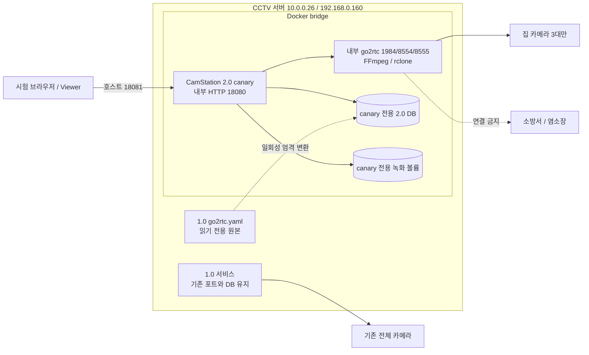

# go2rtc 기준 Docker canary 설계

> 주의: 이 설계는 기존 1.0 서비스를 정지하거나 수정하지 않는다. `집-`으로 시작하는
> 활성 go2rtc 스트림 세 쌍만 새 2.0 DB로 변환한다. 원본 URL, 계정, 비밀번호는 로그,
> manifest, 문서에 기록하지 않는다.

## 목표

현재 영상을 정상 제공하는 1.0 go2rtc 설정을 카메라 정보의 유일한 원본으로 삼아,
`집-마당`, `집-창고1`, `집-창고2`만 포함하는 CamStation 2.0 Docker canary를 만든다.
1.0 SQLite의 카메라, ONVIF, 레이아웃, 작업, 백업, 알림 데이터는 가져오지 않는다.

## 운영 경계

컨테이너는 bridge 네트워크를 사용한다. 내부 포트는 다른 컨테이너와 같아도 되며,
호스트에 공개하는 HTTP 포트와 writable volume만 인스턴스별로 달라야 한다.
go2rtc API 1984, RTSP 8554, WebRTC 8555는 모두 컨테이너 내부 기본 포트를 유지하고
호스트에는 공개하지 않는다.

## go2rtc 변환 계약

변환기는 YAML의 주석 처리되지 않은 `streams` mapping만 읽는다. 주석 처리된 카메라는
YAML parser 결과에 존재하지 않으므로 선택할 수 없다.

선택 조건은 모두 만족해야 한다.

1. main key가 `집-`으로 시작하고 `_sub`로 끝나지 않는다.
2. main key는 CamStation의 안전한 stable stream key 규칙을 통과한다.
3. main과 `${key}_sub`가 각각 정확히 하나의 scalar URL producer를 가진다.
4. URL scheme은 RTSP/RTSPS/HTTP/HTTPS 중 하나이고 host와 port가 유효하다.
5. loopback, localhost, go2rtc 재귀 producer, `ffmpeg:` recipe는 canary 입력으로 거부한다.
6. 선택 결과가 정확히 3대가 아니면 새 DB를 만들지 않는다.

각 카메라는 다음 2.0 graph로 변환한다.

| 2.0 항목 | go2rtc 원본 | 정책 |
|---|---|---|
| camera key/name | main stream key | 동일 문자열 |
| recording input | main producer | copy, on-demand |
| live input | `${key}_sub` producer | auto video, audio off, on-demand |
| focus output | main producer | auto H.264 호환, 최대 1920×1080, audio off |
| ONVIF/control | 가져오지 않음 | canary 영상 검증 범위 밖 |

새 DB에는 3개 카메라와 3타일 기본 레이아웃만 만든다. 녹화는 1분 segment,
20 GB 상한, 1일 보존으로 제한하고 백업 schedule과 알림 전달은 비활성화한다.

## 컨테이너 계약

이미지는 `camstationd`, go2rtc 1.9.14, FFmpeg/ffprobe, rclone과 init process를 포함한다.
상태와 미디어는 이미지 밖의 bind mount에 저장한다.

| 경계 | canary 값 |
|---|---|
| HTTP | `10.0.0.26:18081` → container `18080/tcp` |
| media ingress | same-origin HTTP `/player/api/ws` MSE |
| state | root 전용 `.env`의 `CANARY_STATE_DIR` bind mount |
| media | root 전용 `.env`의 `CANARY_MEDIA_DIR` bind mount |
| restart | 시험 중 자동 부팅 금지 |
| privilege | non-root, all capabilities dropped, read-only root filesystem |

canary 영상 검증은 공개 HTTP의 `/player/api/ws`를 통한 MSE로 고정한다. 관리용 `/live`는
WebRTC를 먼저 시도한 뒤 MSE로 전환할 수 있지만, 전용 `/viewer`는 1.0 Viewer 동작에 맞춰
MSE를 먼저 연결한다. 판정 시 실제 transport가 `mse`이고 재생 시간이 지속적으로 증가하는지
확인한다. Direct WebRTC는 이번 HTTP-only canary의 합격 범위가 아니다.

## 중단 및 합격 기준

다음 중 하나라도 발생하면 canary만 즉시 중지한다.

- 1.0 health 또는 활성 카메라 수가 기준선에서 이탈한다.
- generated go2rtc config에 `집-` 외 public/private stream이 생긴다.
- 컨테이너가 소방서 또는 염소장 endpoint로 연결을 시도한다.
- 지정하지 않은 host port, state path, media path를 사용한다.
- 세 집 카메라 중 하나라도 실시간 영상 또는 녹화 byte 증가를 증명하지 못한다.

합격하려면 1.0의 8대 운영이 유지되고, 2.0 API에 활성 카메라가 정확히 3대이며,
세 카메라 모두 명시적으로 확인한 MSE 영상과 recorder byte 증가 증거가 있어야 한다.

## 증거 → 결론 → 경로

### E-001

- title: 운영 Docker와 자원 기준선
- observed_at: 2026-08-09 KST
- source_type: command
- source_ref: production Docker/systemd/port read-only inspection
- content_hash: n/a
- repro_command: `docker version && docker compose version && systemctl is-active docker`
- raw_excerpt: Docker 29.2.1, Compose 5.0.2, Docker active/enabled
- linked_workitem: canary runtime
- supersedes: none

### E-002

- title: 집 카메라 go2rtc 구조
- observed_at: 2026-08-09 KST
- source_type: file
- source_ref: active 1.0 go2rtc YAML의 secret-safe structural inspection
- content_hash: `8c94606e0f99d6ea2574f8163a89fad755004fe31704f94fc4cb2dfbedcee9eb`
- repro_command: root 전용 운영 inventory가 지정한 원본에서 SHA-256 재계산
- raw_excerpt: 활성 카메라 8대, `집-` main/sub 3쌍은 각각 단일 RTSP scalar producer
- linked_workitem: YAML importer
- supersedes: none

### F-001

- title: go2rtc YAML 단독으로 영상 canary DB를 생성할 수 있음
- severity: info
- category: design
- status: validated
- evidence_ids: [E-002]
- location: 1.0 go2rtc streams mapping
- impact: 1.0 DB에 의존하지 않고 현재 재생 중인 집 카메라만 이전 가능
- confidence: high
- repro_steps: YAML hash를 고정하고 `집-` main/sub 구조를 secret-safe manifest로 검사한다.
- remediation: n/a

### P-001

- title: 읽기 전용 YAML에서 격리 canary까지
- path_type: callflow
- start: active 1.0 go2rtc YAML
- goal: three-camera 2.0 container validation
- steps:
  1. action: source hash and strict subset parse — evidence: E-002 — finding: F-001
  2. action: atomically create a new 2.0 DB — evidence: E-002 — finding: F-001
  3. action: run the isolated container and compare 1.0 baselines — evidence: E-001 — finding: none
- residual_risks: 집 카메라의 중복 session 허용 여부와 실제 MSE/녹화는 runtime에서 별도
  증명해야 하며 direct WebRTC는 이번 시험에서 검증하지 않는다.
