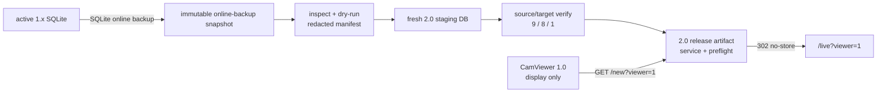

# CamStation 1.x production cutover preparation design

> Status: source preparation complete; production installation and runtime gates pending
>
> Production changes: prohibited until the preparation gates in this document pass

## Decision and observed baseline

The approved sequence is server-first. CamStation 2.0 replaces the 1.x server runtime while
CamViewer 1.0 temporarily acts only as an Electron display shell. Viewer telemetry, remote
commands, managed updates, and native Viewer 2.0 lifecycle behavior are not required during
that transitional phase. Eight-camera visual playback is still required.

Read-only production APIs were rechecked on 2026-08-09 before this design was written. The
secret-free baseline is:

| Surface | Observed value | Preparation consequence |
| --- | --- | --- |
| Cameras | 9 registered, 8 enabled and online, `소방서2` disabled | Import and verification must preserve `9/8/1`. |
| Camera keys | All nine stable IDs contain Hangul; all have sub streams | 2.0 must preserve safe Unicode stream keys or use an explicitly approved mapping. Silent ASCII fallback is forbidden. |
| Layout | One `48 × 48` layout containing the eight enabled camera keys | Current production layout needs no coordinate scaling, but generic import must validate and normalize other source grids. |
| Recording | 30-minute segments, 30-day retention, 700 GB configured maximum | Production environment and imported settings must not inherit development defaults. |
| Motion | Disabled | Missing 2.0 motion parity does not block this cutover unless the operator changes the requirement. |
| Viewer 1.0 entry | Hard-coded `/new?viewer=1` | 2.0 must provide an exact, non-cacheable compatibility redirect to `/live?viewer=1`. |

Raw camera URLs, ONVIF credentials, backup destinations, tokens, and SSH material are not part
of this baseline and must never appear in committed evidence.

## Preparation architecture



Preparation produces immutable release inputs and offline evidence. It does not write the
active 1.x database, restart either server generation, switch nginx, or change the NUC.

## Compatibility and stable-key contracts

The transitional Viewer route contract is intentionally narrow:

```text
GET /new?viewer=1  ->  302 Location: /live?viewer=1
Cache-Control: no-store
```

Any other query at `/new` redirects to `/`. Non-GET methods are rejected with `405` and
`Allow: GET`. `/new/...` subpaths remain ordinary SPA fallback paths and do not enter the
compatibility handler.

Camera `streamName` values are database keys, URL path values, go2rtc stream prefixes, layout
keys, and archive correlation keys. A valid key must:

- be valid UTF-8 and at most 128 bytes;
- start and end with a Unicode letter, Unicode number, or underscore;
- contain only Unicode letters, Unicode numbers, underscore, or an internal hyphen;
- exclude slash, backslash, dot, whitespace, percent encoding, query/fragment markers,
  control characters, and URL-like schemes.

This admits the observed Hangul IDs without allowing path or URL injection. New cameras may
still receive generated ASCII slugs; an imported stable Hangul key must remain editable rather
than being regenerated.

## Offline importer contract

The importer is a separate maintenance command, not a daemon HTTP endpoint. Its supported
operations are:

| Operation | Reads | Writes | Required result |
| --- | --- | --- | --- |
| `snapshot` | active 1.x SQLite through a read-only connection | a new immutable snapshot path | SQLite online backup, quick-check, schema and expectations pass; no overwrite |
| `inspect` | read-only 1.x snapshot | none | Schema/quick-check, counts, optional-field presence, secret fingerprints only |
| `dry-run` | read-only 1.x snapshot | none | Deterministic converted manifest and all blockers |
| `import` | read-only 1.x snapshot | a fresh inactive 2.0 staging DB | Complete camera/layout/settings graph or no promoted target |
| `verify` | source snapshot and inactive 2.0 DB | none | Canonical manifests match and operational invariants pass |

The `snapshot` source is an active regular, non-symlink SQLite file opened read-only. It uses the
embedded driver's online-backup API, so a WAL-sidecar shell copy is never used. All later source
operations require the resulting regular, non-symlink snapshot. The target must not be the active
daemon DB. Import builds a fresh staging DB, closes and verifies it, then promotes it through a
same-filesystem no-overwrite hard link. A pre-existing different target is never overwritten; an
identical inactive target is reported as `already-current`.

### Camera conversion

For each non-archived source row:

| 1.x field | 2.0 field | Rule |
| --- | --- | --- |
| `id` | `streamName`, `layoutKey` | Preserve after stable-key validation. |
| `display_name` | `name` | Preserve as the operator label and new archive label. |
| `enabled` | `enabled` | Preserve exactly; `소방서2` remains false. |
| `main_stream_url` | recording input | Keep only in the private target DB; report a SHA-256 fingerprint, never the value. |
| `sub_stream_url` | live input | Use when present; otherwise live output uses the recording input. |
| ONVIF fields | control metadata | Import only when the 2.0 model can represent them without combining distinct accounts. A distinct legacy ONVIF account is fail-closed and reported as deferred; video import continues under the approved display-only criterion, while the immutable source retains the original. |
| `location`, `notes`, `sort_order` | migration manifest | Preserve in the redacted migration archive until an equivalent 2.0 field is approved. Nonempty values are never silently discarded. |

Every camera receives exactly three server-owned outputs:

- recording: recording input, `copy`, source audio, on-demand;
- live: live input when present, otherwise recording input, `auto`, no audio, on-demand;
- focus: recording input, `auto`, maximum `1920 × 1080`, no audio, on-demand.

Imported policies begin pending. First 2.0 startup applies all enabled pending policies as one
bootstrap operation and records the applied revision only after go2rtc accepts the generated
configuration. Disabled cameras remain stored but are excluded from runtime generation.

A legacy `sub_stream_url` may be a local go2rtc recipe rather than a camera endpoint. The only
accepted derived form is an exact loopback `ffmpeg:rtsp://...:8554/<same camera key>` H.264 recipe
with optional bounded even width/height. It maps to a 2.0 H.264 live output sourced from the
recording input; it must never be stored as a second recursive input. Any other producer recipe
blocks import.

### Layout and settings conversion

Layout item keys must resolve to imported cameras. For a source grid of 48 columns, coordinates
are preserved. For another positive divisor of 48, horizontal position, width, and `minW` are
multiplied by `48/source_grid_cols`; non-integral scaling, bounds violations, duplicate keys, or
overlap introduced by conversion blocks import. Vertical coordinates are preserved and checked
against the 48-row workspace.

The current production settings map to 30-minute segments, 30-day retention, and 700 GB maximum
storage. Backup remains disabled in the imported DB until an operator supplies and verifies the
production rclone target through a root-owned runtime configuration. `protectUnbacked=true` is
mandatory. Alert secrets and Viewer registry/command rows are not imported.

## Production release and service contract

The release must contain the Go binary with embedded web assets, release manifest and SHA-256,
offline importer, production systemd unit, environment validator, nginx location includes,
nginx preparation, preflight/switch/rollback helpers, and this runbook. Runtime paths and secrets remain in a
root-owned deployment manifest outside Git. The bundle builder refuses non-`main` or dirty trees.

The production service must use a persistent working directory and explicit values for:

```text
CAMSTATION_ADDR=127.0.0.1:18080
CAMSTATION_DB=<inactive 2.0 state DB>
CAMSTATION_RECORDINGS_DIR=<2.0 recordings root>
CAMSTATION_TEMP_DIR=<2.0 temp root>
CAMSTATION_VIEWER_RELEASES_DIR=<Viewer release root>
CAMSTATION_RECORDING_ENABLED=true
CAMSTATION_SEGMENT_MINUTES=30
CAMSTATION_MAX_STORAGE_GB=700
```

On the production `cctv` host, the state DB and Viewer artifacts remain under the approved state
root, while recordings and temporary segments use the dedicated media root defined only in the
root-owned deployment configuration. Recording and temp must share that filesystem so segment
finalization remains atomic; preflight rejects a split-filesystem configuration.

Before the maintenance window, nginx preparation verifies the exact reviewed 1.x site hash,
moves the duplicate enabled backup out of the wildcard include directory, preserves root-only
rollback copies, and reloads one server block whose active symlink still targets the byte-equivalent
legacy locations. Maintenance and 2.0 includes remain inactive until the handoff.

`go2rtc`, ffmpeg, and rclone must be present for production but remain supervised or invoked by
CamStation. The unit uses `Restart=on-failure` and `KillMode=control-group`; nginx exposes only
the daemon, while go2rtc API/RTSP stay on loopback. WebRTC's required listener is validated
against the existing firewall and monitor LAN during rehearsal.

Boot ownership changes inside the same rollback boundary as runtime ownership. Before handoff,
all legacy units must be active/enabled and 2.0 inactive/disabled. A successful switch disables
legacy autostart before enabling 2.0; automatic or manual rollback disables 2.0 and re-enables
the exact legacy units before returning traffic.

## Gates and rollback boundaries

| Gate | Evidence | Result before production rehearsal |
| --- | --- | --- |
| Compatibility | Positive/negative route tests; production web build embedded | Must pass |
| Stable keys | All nine Hangul IDs accepted; unsafe path/URL values rejected | Must pass |
| Import | Synthetic legacy fixture plus final snapshot dry-run; `9/8/1`, 9 sub streams, one layout/eight items, 30/30/700, layout keys resolved | Must pass |
| Runtime package | systemd/env/nginx/preflight syntax and clean-host build | Must pass |
| Camera runtime | Eight live outputs and eight growing recorders | Production-only gate |
| Backup | Correct remote, eight uploads, eight DB marks, zero premature deletes | Production-only gate |
| Transitional display | CamViewer 1.0 restart, redirect log, eight visible videos | Production-only gate; telemetry not required |
| Viewer 2.0 | Native telemetry, control, auto-start, reconnect | Later independent client gate |

Server-gate failure restores the preserved 1.x runtime. Viewer-2.0-only failure keeps the
accepted 2.0 server and relaunches CamViewer 1.0 through the compatibility route.

## Evidence → finding → path

| Evidence | Finding | Path |
| --- | --- | --- |
| 1.x Viewer source fixes startup at `/new?viewer=1`; 2.0 uses `/live?viewer=1` | The old shell is usable only through a bounded redirect. | Implement route and negative tests before release. |
| Safe production API lists nine Hangul IDs and one 48-column layout keyed by those IDs | ASCII-only regeneration would break stable identity and layout correlation. | Admit bounded Unicode keys and preserve them during import. |
| The implementation previously had no production importer or production unit | Source build success alone could not perform a reversible cutover. | The importer and packaging artifacts now exist and pass source/synthetic tests; keep production No-Go until installed and rehearsed. |
| The active server has separate legacy backend, backup, and go2rtc units using 1984/8554/8555; 18080 is free | Code/data can be staged concurrently, but the two runtime generations cannot run together. | Stop only the exact three legacy units, prove media ports free, then start 2.0; keep nginx and VStarcam TLS proxy active. |
| Current nginx has two server blocks with `/api/`, `/go2rtc/`, `/assets/`, and `/` locations | Adding the packaged 2.0 `location /` directly would conflict with the current configuration. | Preserve each existing location set as a legacy include and install an active-symlink include before any switch rehearsal. |
| Existing 1.x server reports eight enabled/online cameras; recorder and backup evidence is healthy | A replacement must prove more than UI rendering. | Keep camera, recording, backup, and rollback gates even though legacy telemetry is waived. |
