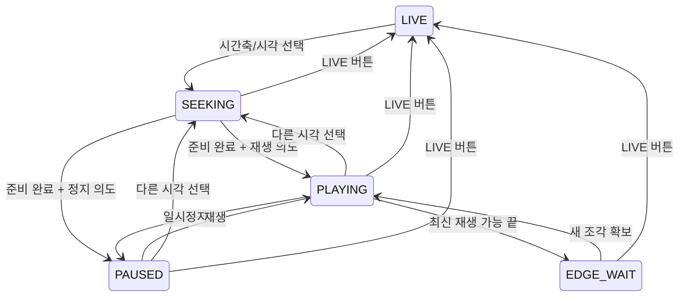

# 라이브·녹화: 화면에서 백엔드까지 구현 분석

상태: 2026-09-09 요구사항 기반 분석·구현 설계 초안. 제품 구현·배포 완료를 뜻하지 않는다.

근거: [사용자 합의와 기존 화면 관찰](2026-09-09-recordings-playback-ux-design.md), [현재 구현 상태](../../07-implementation-status.md), 현재 체크아웃 소스. 이번에는 기존 화면 캡처 기록과 소스를 분석했으며 운영 화면을 새로 조작하지 않았다.

검증 제약: 로컬 환경과 테스트 PC만 사용하며 실제 카메라는 최대 2대다. 기존 중계 입력을 공유해 추가 송출을 최소화한다. 부하 검사는 수행하지 않는다. 연결 복구는 테스트 측 수신을 끊었다 다시 연결해 확인한다. 별도 강제종료·전원/DB crash 주입 검사는 하지 않는다. 제품 지원 수 제한은 아니다. 상세 기준은 [검증 환경 계획](../plans/2026-09-09-playback-screen-to-backend-plan.md)을 따른다.

분석 순서는 **화면 요구사항 → 화면 구성 → 컴포넌트 이벤트·기능 → 프런트엔드 구현 설계 → 백엔드 기능 → 백엔드 구현 설계**다. 아래 ID는 화면에서 서버·검증까지 요구를 추적하기 위한 식별자다. 제안 파일·API 이름은 구현 시 조정할 수 있지만 동작 계약은 유지한다.

## 최신 범위·완료 기준 — 사용자 지시 우선

요청한 화면·이벤트·재생 기능을 구현하고, 이번 변경으로 실제 운영이 불가능해지는 문제만 출시 전 필수 조치로 다룬다. 아래 이전 단계별 항목도 이 기준으로 좁혀 적용하며 자동으로 모두 실행하지 않는다.

- 필수: 선택한 영상이 재생되지 않음, 시각 탐색·집중 보기·LIVE 복귀가 동작하지 않음, 신규 녹화가 멈추거나 저장 영상이 훼손됨 등 요청 기능 또는 기존 핵심 운영을 막는 구체적인 문제.
- 후순위: 성능·자원 최적화, 정밀한 오차 튜닝, 드문 장애 조합, 관측 기능 확장, 포괄적인 호환·복구 강화 등 운영 중 모니터링으로 확인하며 조정할 수 있는 작업. 이번 구현·완료 조건에서 제외한다.
- 불확실한 가능성만으로 작업·테스트를 추가하지 않는다. 실행한 기능 확인에서 운영을 막는 실패가 나오면 그 원인만 수정하고 영향받는 기능만 다시 확인한다.
- 로컬·테스트 PC, 실제 카메라 최대 2대로 요청 기능을 확인한다. 연결 복구는 수신 측 연결 해제/재연결로 확인한다. 부하 검사·장시간 반복·추가 검증 캠페인은 하지 않는다.
- 프로젝트 필수 빌드·검사는 변경면에 맞게 수행하되, 통과한 검사를 이유 없이 반복하거나 모든 화면·환경에 곱해서 수행하지 않는다. 요청 기능이 동작하고 운영을 막는 구체적인 미해결 문제가 없으면 종료한다.


## 1. 대상 화면과 요구사항

여기서 웹뷰는 일반 브라우저로 접속하는 웹 화면, 클라이언트는 공식 Windows Electron Viewer로 정의한다. 실제 클라이언트 콘텐츠도 서버의 React 화면이므로 네 화면을 네 벌로 구현하지 않는다. 브라우저의 `?viewer=1`은 Viewer 셸 미리보기이며 네이티브 클라이언트의 증거가 아니다.

| 화면 ID | 경로·현재 진입점 | 유지할 프레임 | 새 본문 요구 |
| --- | --- | --- | --- |
| WL 웹 라이브 | `/live`, `LivePage → LiveWorkspace` | 콘솔 사이드바 없는 관제 화면, 기존 배치 도구·우측 패널 | 기존 그리드 + 공통 시각 타임라인 + 라이브/재생 모드 |
| WR 웹 녹화 | `/recordings`, `OperatorRecordingsPage` | 콘솔 사이드바·상태 헤더 | B 탐색형 기본, 영상 재생/녹화 관리 탭으로 작업 분리 |
| CL 클라이언트 라이브 | `/live?viewer=1`, 같은 `LiveWorkspace` | Windows 창틀·메뉴, Viewer 라이브/녹화 탭 | WL과 동일한 그리드·타임라인 동작, 네이티브 전체화면·관리 연결 연동 |
| CR 클라이언트 녹화 | `/recordings?viewer=1`, `ViewerRecordingsPage` | Windows 창틀·메뉴, Viewer 탭 | WR과 동일한 B 탐색형, 관리·삭제·다운로드 미노출 유지 |

별도 `/viewer → ViewerPage`는 간소화 MSE 페이지로 공식 클라이언트 진입점이 아니다. 이번 변경 대상에 추가하지 않으며 공통 모듈 변경의 회귀만 검사한다. `/` 관제 요약도 자동 재생 그리드로 바꾸지 않는다.

### 기능 요구

| 요구 ID | 요구 | 적용 화면 |
| --- | --- | --- |
| R01 | 기존 셸 안에 영상과 조작부를 고정하고 보조 목록만 독립 스크롤 | 네 화면 |
| R02 | 큰 단일 영상·우측 목록·하단 시간축의 2번 탐색형 | WR, CR |
| R03 | KST 날짜·절대시각으로 탐색, 커서는 실제 재생 시각을 표시 | 네 화면 |
| R04 | 라이브 시간축 클릭으로 현재 배치의 모든 카메라를 같은 절대시각 재생으로 전환 | WL, CL |
| R05 | 기존 집중 보기 확대·복귀 시 모드·재생 위치·일시정지·배속 유지 | WL, CL; 녹화 영상 전체화면에도 상태 유지 |
| R06 | 타임라인 LIVE 버튼: 라이브에서 켜짐, 재생에서 꺼짐, 클릭 시 라이브 복귀 | WL, CL |
| R07 | 공통 재생/일시정지·±10초·배속·연속 파일 이동 | 네 화면, 단일/다중 대상 수만 다름 |
| R08 | 녹화 중 완성 조각부터 재생, 전체 보관 파일 마감 대기 제거 | 네 화면 |
| R09 | 녹화 공백·로딩·실패·최신 대기를 구분, 카메라 하나의 문제로 다른 영상 시각 변경 금지 | 네 화면 |
| R10 | 기존 배치·영상 transform 줌/팬·관리 기능·과거 녹화 보존 | 네 화면 |
| R11 | 기존 복구가 의도적인 pause·녹화 재생을 실제로 중단시키지 않음. 표시 개선만은 후순위 | CL, CR; 동작 차단 시 최소 수정 |

확정 요구와 구분하는 구현 기본값: 재생 끝에서는 새 녹화를 기다리며 자동 LIVE 전환하지 않는다. 초기 라이브 진입은 라이브 모드다. 녹화 초기 진입은 카메라/날짜와 목록을 표시하고 자동 재생하지 않는다. 목록 항목 선택은 선택 구간 시작부터 재생한다. 재생 중 시각 탐색은 현재 재생/일시정지 의도를 유지하며, 라이브에서 처음 과거 시각을 선택하면 재생을 시작한다.

## 2. 화면 구성부터 정의

아래는 이벤트 배치를 검토하는 구조 와이어프레임이다. 픽셀 시안은 기존 [웹 B](2026-09-09-recordings-ux-assets/console-02-browser-v2.png), [클라이언트 B](2026-09-09-recordings-ux-assets/viewer-02-browser.png)를 참고한다. 라이브는 기존 배치를 유지한다.

### WL — 웹 라이브

```text
┌ L1 기존 관제 도구줄: 배치·저장·패널·[라이브/재생]·전체화면 ┐
│ L2 카메라 그리드 또는 동일 타일 집중 보기 │ L3 기존 우측 패널 │
│   [카메라 이름 / 모드 / 연결·녹화 상태]   │ 배치·카메라·PTZ   │
├ T1 [날짜][시각 KST] [재생/정지][±10초][배속][음량] [● LIVE] ────┤
│ T2 선택 카메라 녹화 범위 ──────│재생 커서─────────────── │
│ T3 배치 카메라 합집합  ──────│─────────────────────── │
│ T4 시간축 확대·축소 / 가로 이동 / 접기                     │
└─────────────────────────────────────────────────────────┘
```

### CL — 클라이언트 라이브

```text
┌ N1 Windows 창틀·네이티브 메뉴 ───────────────────────────┐
│ N2 CamStation Viewer       [라이브] [녹화]                │
│ L1 기존 관제 도구줄 (모드는 현재 작업 영역 상태를 반영)    │
│ L2 동일 그리드/집중 보기                │ L3 우측 패널   │
│ T1~T4 동일 시간축·재생 조작·LIVE 복귀                     │
└─────────────────────────────────────────────────────────┘
```

L2/R3의 공백 상태에는 `다음 녹화` 버튼, 오류 상태에는 `다시 시도` 버튼을 표시한다. WR/CR의 목록이 접히는 폭에서는 R2에 `녹화 목록` 버튼을 남긴다. 새 버튼은 아래 E22/E23/E32의 기존 탐색·재시도 동작을 호출한다.

CL은 상단 Viewer 탭 높이까지 뺀 가용 높이를 사용한다. 현재 외부 탭과 내부 관제 도구줄을 임의로 합치지 않는다. 라이브 도구줄의 고정 LIVE 표시도 상태 배지로 바꿔 하단 버튼과 모순되지 않게 한다.

### WR — 웹 녹화

```text
┌ 기존 콘솔 사이드바 ┬ 기존 상태 헤더 ─────────────────────┐
│                   │ R1 [영상 재생] [녹화 관리]          │
│                   │ R2 [카메라 이름] [날짜] [시각 KST]  │
│                   │ R3 큰 단일 영상 │ R4 구간 목록     │
│                   │                 │ 시각·길이·상태   │
│                   │                 │ 독립 스크롤      │
│                   │ R5 재생·정지·±10초·배속·음량·전체화면│
│                   │ T2/T4 단일 카메라 시간축             │
└───────────────────┴─────────────────────────────────────┘
```

영상 재생 탭을 기본으로 한다. 녹화 관리에는 저장소/워커/기존 관리 목록과 삭제·파일 다운로드를 유지한다. 관리 탭 조회·필터와 재생 목록 탐색은 상태를 분리한다. 썸네일, 임의 구간 내보내기, AI 이벤트는 필수 범위가 아니며 데이터 없이 시안 장식을 기능처럼 표시하지 않는다.

### CR — 클라이언트 녹화

```text
┌ N1 Windows 창틀·네이티브 메뉴 ───────────────────────────┐
│ N2 CamStation Viewer       [라이브] [녹화]                │
│ R2 [카메라 이름] [날짜] [시각 KST]                        │
│ R3 큰 단일 영상                    │ R4 녹화 구간 목록   │
│ R5 재생 조작·음량·전체화면          │ 독립 스크롤         │
│ T2/T4 단일 카메라 시간축                                  │
└─────────────────────────────────────────────────────────┘
```

CR에는 관리 탭을 만들지 않는다. Viewer의 기존 readOnly는 UI 제약이지 서버 인증·인가가 아니다. 이 작업에서 query string을 보안 권한으로 승격하지 않는다.

### 공통 표시·입력 규칙

- 모드 표시는 LIVE와 `녹화 재생 · YYYY-MM-DD HH:mm:ss KST`를 구별한다. 일시정지·대기·실패는 별도 상태다. LIVE 켜짐이 모든 카메라 온라인이라는 뜻은 아니다.
- LIVE는 꺼진 모양이어도 클릭 가능한 버튼이다. 시간축을 접어도 모드·시각·LIVE 복귀는 남긴다.
- 선택 트랙은 해당 카메라 범위, 전체 트랙은 현재 배치의 합집합이다. 합집합 막대가 모든 카메라의 녹화 존재를 의미하지 않도록 라벨/툴팁을 둔다. 모션 데이터 없는 현재 상태에서 가짜 이벤트 막대 금지.
- 영상 휠은 transform 줌, 확대된 영상 드래그는 팬. 타임라인 휠은 시간축 배율, 타임라인 배경 드래그는 시간 범위 이동, 커서 드래그는 재생 위치 선택이다.
- 사용자 추가 정정: 큰 화면은 기존 `집중 보기` 기능을 뜻한다. 기존 버튼과 타일 확대 동작을 재사용하고 재생 모드·시각만 연동한다. 영상 더블클릭 줌 초기화와 이벤트 전파를 변경하거나 별도 줌 초기화 버튼을 추가하지 않는다. 새 제스처 설계는 이번 범위가 아니다.
- PTZ는 라이브에서만 조작한다. 재생 전환 시 기존 hold Stop을 완료하고 패널을 닫는다. 녹화 탐색은 실제 카메라를 움직이지 않는다.
- 녹화 재생은 기본 음소거이며 음량을 켜면 선택 카메라 하나만 출력한다. 지원되지 않는 음성은 사용 불가로 표시한다. 실시간 음성/대화 기능까지 새로 개발하지 않는다.
- 로컬 웹과 테스트 PC의 실제 창 크기로 확인하고, 목록이 드로어로 전환되는 좁은 폭을 한 번 확인한다. 해상도·DPI별 반복 행렬은 만들지 않는다. 좁은 화면은 목록 드로어/시트 사용, 영상·필수 조작부 우선. 타임라인·영상·목록의 스크롤 입력은 서로 침범하지 않는다.

## 3. 컴포넌트 이벤트 → 기능 정의

| 이벤트 ID / 발생점 | 입력·선행 조건 | 기능·상태 결과 | 서버 의존 |
| --- | --- | --- | --- |
| E01 L2 타일 선택 | cameraKey | selectedCamera 변경, 선택 트랙·음량 대상 변경; 공통 시각 불변 | 해당 카메라 시간 범위 조회 |
| E02 T2/T3 클릭 또는 커서 드래그 완료 | atMs, 카메라 집합 | 라이브→재생 또는 공통 seek; 이전 요청 취소, 최신 선택만 반영 | B01, B02, B03 |
| E03 T1/R2 날짜 선택·시각 확정 | browseDate, 유효 KST 시각 | 날짜 선택은 표시 범위/목록만 변경, 시각 Enter 또는 이동 확정은 seek; 빈 구간도 요청 시각 유지 | B01, B04; 시각 확정 시 B02 |
| E04 T4 배율·가로 이동 | viewport [from,to) | 표시 범위만 이동, 재생 시각은 그대로; 구간 조회 갱신 | B01 |
| E05 T1/R5 재생·정지 | playback 모드 | 공통 시계 시작/정지; live에서는 비활성 | 버퍼 부족 시 B03, 일반 조작은 로컬 |
| E06 T1/R5 ±10초·배속 | playback 및 선택 시각 존재; atMs±10000 / rate | 상대 이동도 절대시각으로 계산; 배속은 전체 참여 타일에 적용 | 이동 시 B02/B03 |
| E07 L2 기존 집중 보기 진입·복귀 | cameraKey | presentation만 grid↔focus; 모드·시계·줌·배속 유지 | 신규 resolve 불필요, 재부착 시 같은 시각 |
| E08 Escape | 입력/다이얼로그 우선 처리 후 | 집중 보기 종료; 라이브 전환 아님. OS 전체화면 이벤트와 분리 | 없음 |
| E09 T1 LIVE | 현재 모드 무관 | DVR 요청 취소·epoch 갱신·녹화 adapter 해제·실제 live adapter 연결; 시계 live로 | 기존 라이브 스트림 연결 |
| E10 R4 목록 항목 선택 | 구간 시작/ID | 선택 카메라의 동일 플레이어에서 재생 시작, 별도 창 열지 않음 | B02/B03 |
| E11 R2 카메라 선택 | 보관 카탈로그의 cameraKey | 목록/트랙 대상 변경과 paging 초기화; 재생 시각이 있으면 그 날짜·시각에 맞춰 새 카메라 resolve, 없으면 선택 대기 | B01, B04, 필요 시 B02 |
| E12 R4 같은 조건 조회 갱신·추가 로드 | 동일 필터/cursor | 목록만 갱신, 재생/선택/스크롤 불변; 삭제된 선택은 삭제 상태 표시 | B04 |
| E13 영상 wheel/pan/reset | viewport | 영상 내용 transform만 변경; 시간 불변; 라이브 저장 줌 별도 보존 | 배치 저장 때만 기존 API |
| E14 L1/R5 전체화면 | 사용자 입력 | 브라우저 또는 native adapter; 재생 상태 불변 | native IPC 또는 DOM |
| E15 media seeked/playing/frame | epoch, actualMediaTime | 공통 목표 시각과 실제 프레임 시각 비교; 타일 상태·커서 갱신 | 없음 |
| E16 media waiting/error | epoch, 원인 | 로딩/오류 표시·제한 재시도; 실제 live로 대체 금지 | B02/B03 재조회 |
| E17 파일 끝·새 fragment | coverage/edge | 다음 구간 이어 받기, 공백이면 해당 타일 gap, 최신 끝이면 edge_wait | B01/B03 |
| E18 L1 배치 변경 | 현재 mode/atMs, 다음 집합 | 공통 시각 유지, 추가 카메라는 그 시각 합류, 제거 타일 연결 해제 | 새 대상 B01/B02 |
| E19 N2/내비게이션 화면 이동 | 대상 route | 해당 workspace 연결 정리; viewer query·base path 유지 | 기존 페이지 데이터 |
| E20 클라이언트 연결복구/원격 명령 | 명령 종류·현재 route/mode | 5절 native 계약 적용; 자동 reconnect가 재생을 live로 밀어내지 않음 | 관리 프로토콜·B07 |
| E21 T1/R5 음소거·음량 | playback, 선택 카메라의 지원 음성, volume 0..1 | workspace mute/volume 갱신, 선택 영상 하나에만 적용; 선택/focus 변경 시 이전 출력부터 mute, LIVE 복귀 시 녹화 음성 해제 | 없음 |
| E22 L2/R3 공백의 다음 녹화 | nextAtMs 존재 | 단일은 해당 카메라, 다중은 배치 합집합의 가장 가까운 다음 시작으로 E02 호출; 없음은 비활성, 현재 pause/rate 유지 | B02의 nextAtMs |
| E23 L3 다시 연결 / L2·R3 다시 시도 | cameraKey, 현재 mode/clock | live는 기존 reconnectGeneration; playback은 해당 카메라만 공통 시각에 resolve/attach, 다른 타일·pause·rate 유지 | 기존 live 또는 B02/B03 |
| E24 WR R1 재생/관리 탭 | 다음 탭 | 관리 진입 시 재생 pause·음소거·시각 보존, 미디어 수신 중단 가능; 재생 탭 복귀는 같은 위치에서 paused, 사용자가 재생 | 재부착 시 B02/B03 |
| E25 L1/L3 우측 패널 토글·숨김 | panelOpen | 기존 표시/숨김, PTZ hold는 Stop; 공통 시계·adapter 불변 | 기존 PTZ Stop만 |
| E26 L1/T4 시간축 접기·펼치기 | collapsed | 기존 저장값/dirty 갱신, 모드·시각·LIVE는 남김; 시계 불변 | 배치 저장 때만 기존 API |
| E27 L2 배치 이동·크기 조절 | 기존 layout 좌표 | geometry/dirty만 변경, 동일 타일 재생 유지; focus에서는 기존 편집 금지 유지 | 저장 때만 기존 API |
| E28 L1/L3 배치 저장·새 이름·삭제 | 기존 입력/확인 | 기존 CRUD/오류 처리 유지; 저장은 geometry/live 줌/접힘 설정만, DVR 시각·임시 줌 제외; 삭제 후 대상 변경만 E18 | 기존 layouts API |
| E29 WR 관리 목록 필터·상세·닫기·재생·다운로드·삭제/취소 | 기존 필터/segment ID | 필터·상세·닫기·다운로드·삭제 확인은 기존 handler 유지; 재생 버튼은 B 재생 탭의 E10으로 연결, 관리 상세에서 두 번째 video를 띄우지 않음; 삭제 시 관련 query invalidation | 기존 recordings API; 재생은 B02/B03 |
| E30 WR 워커 전체/개별 시작·중지·새로고침 | 기존 pending/enabled 조건 | 기존 mutation/상태표시 유지, 녹화 범위 갱신; 재생 mode를 변경하지 않음 | 기존 recorders API |
| E31 WR 저장소 목표 입력·정리 확인/취소·설정 열기 | 기존 유효값/확인 | 기존 cleanup/설정 경로 유지, 삭제된 재생 대상은 gone 처리, 성공/실패 표시 | 기존 cleanup/settings 경로 |
| E32 R2 녹화 목록 열기·R4 닫기·Escape·항목 선택 | 좁은 화면 drawerOpen | 열기/닫기는 재생 불변; 항목 선택은 E10 후 닫기; Escape는 dialog/drawer를 focus보다 먼저 닫음 | 선택 시 E10 외 없음 |
| E33 페이지 초기 진입·조회 실패 재시도 | route, query 결과 | 카메라 카탈로그·기존 배치·범위 조회, 카메라 없음/로딩/실패 구분; 재시도는 실패 query만 갱신; 녹화는 선택 대기, live는 기존 자동 연결 유지 | 기존 cameras/layouts, B01/B04 |
| E34 카메라 카탈로그·배치 대상 변경 통지 | 추가/비활성/삭제/명칭 변경 | live는 기존 대상 갱신, playback은 보관 자료가 있는 대상의 조회 가능성 유지; 배치에서 제거되면 E18; 이름 변경만으로 재생 reset 금지 | 기존 cameras, B04 카탈로그 |
| E35 L1/L3 PTZ 열기·닫기 및 기존 세부 조작 | live와 기존 capability/pending 조건 | 방향/줌 hold 시작·해제/취소/키 입력/즉시 Stop, 속도, 홈 이동/설정, 프리셋 입력/저장/이동/삭제는 기존 handler 유지; playback에서 비활성, 전환·선택 변경·이탈 시 Stop | 기존 camera control API |
| E36 WR 콘솔 헤더 새로고침 | 사용자 클릭 | 기존 query 갱신 유지, 활성 재생 controller/시각을 재생성하지 않음 | 기존 invalidateQueries |

재생/일시정지·±10초·배속은 live 또는 녹화 선택 대기에서는 비활성화한다. 최근 녹화 진입은 시간축/시각 선택으로 제공하며 −10초 버튼에 별도 모드 전환 의미를 추가하지 않는다.

E02는 pointermove마다 재생을 재시작하지 않는다. 드래그 중에는 후보 시각을 표시하고 pointerup에 확정한다. 키보드 탐색도 동일 이벤트를 호출하며 입력창·select·dialog에서는 Space/좌우 단축키를 가로채지 않는다.

E03 세부: 날짜 변경은 browseDate와 목록/시간축 범위를 바꾸고 목록 페이지 cursor와 목록 스크롤만 첫 위치로 초기화한다. 실제 재생 시각·커서는 유지한다. 현재 영상은 유지하고 영상 위 실제 재생 일시를 별도 표시한다. 시각 입력 중에는 draft만 변경하며 Enter/이동 확정으로 날짜+시각을 seek한다. 다른 날짜/카메라 조건 변경과 동일 조건 E12 갱신을 구분한다.

E19 기본값: 경로 이동은 목적 화면의 기본 상태로 진입한다(라이브는 live, 녹화는 선택 대기). 확대·복귀는 경로 이동이 아니므로 재생 상태를 반드시 유지한다. 상단 라이브↔녹화 탭처럼 경로를 바꾸는 이동의 자동 복원은 현재 필수 요구가 아니다. WR 내부 재생/관리 탭은 경로 이동이 아니며 E24의 pause·위치 보존을 따른다.

## 4. 현재 컴포넌트와 프런트엔드 구현 설계

### 현재 구현에서 확인한 차이

| 근거 파일/심볼 | 현재 사실 | 필요한 변경 |
| --- | --- | --- |
| `web/src/layouts/ConsoleLayout.tsx` | viewer 분기가 live 분기보다 먼저이며 두 셸 높이가 다름 | 셸별 가용 높이 계약, 공통 workspace에 높이 전달 |
| `web/src/components/live/LiveWorkspace.tsx:43` | 배치·PTZ·focus·재연결·타임라인이 한 파일에 있음 | 기존 배치 기능을 유지하며 playback 상태/시간축 추출 |
| 같은 파일 `CameraTile`, `LiveVideo` | 타일은 focus double click, 영상은 stopPropagation 후 줌 reset | 기존 입력 의미 유지, focus 상태에 녹화 모드·시계 연동 |
| 같은 파일 `TwoRowTimeline`, `TimelineBar` | LIVE는 div, click은 blur만, 커서는 현재 시각, 두 트랙은 같은 데이터 | 버튼·seek·실제 재생 커서·전체 합집합 구현 |
| `web/src/pages/RecordingsPage.tsx` | 저장소→워커→목록; Viewer에서는 관리 패널만 생략 | WR 관리 탭 분리, WR/CR 공통 B workspace |
| `web/src/pages/recordings/RecordingSegmentsPanel.tsx` | 큰 표 + 24rem 상세, native video controls, ready만 재생 | 관리 목록은 유지, 새 탐색 목록/고정 플레이어 분리 |
| `web/src/app/recordingsQueries.ts` | 목록/상세 query와 삭제 invalidation 존재 | 조회 공통화, 커서 목록·시간 범위·재생 조회 키 추가 |
| `web/src/components/live/useWebRtcMseStream.ts` | live recovery/transport 전용 | DVR seek/paused/edge_wait를 이 hook에 억지로 추가하지 않음 |
| `web/src/components/live/streamSelection.ts` | live/focus 후보 선택 | 녹화 재생에는 현재 live/focus stream을 쓰지 않고 archive resolve 사용 |

현재 `CameraTile`은 `playbackStreamCandidates(camera)`를 사용한다. focus 시 무조건 별도 focus stream을 사용한다고 가정하지 않는다. 녹화 확대에서도 현재 보관 미디어를 유지하며 live 고화질 출력으로 전환하지 않는다.

### 공통 모듈의 책임

아래 모듈은 논리 책임이며 파일별 클래스/추상 계층을 모두 미리 만들라는 뜻이 아니다. 먼저 페이지 2곳에서 사용하는 시간축·상태·녹화 hook을 공유하고, 실제 중복 또는 native 차이가 생긴 경계만 추출한다.

제안 위치는 `web/src/components/playback/`와 `web/src/app/playbackApi.ts`, `playbackQueries.ts`, `playbackTypes.ts`다.

| 모듈 | 한 번 구현하는 기능 | 별도로 남기는 기능 |
| --- | --- | --- |
| `PlaybackTimeline` | 범위 렌더링·좌표→시각·선택·배율·KST·키보드 | live 2트랙 합성 / recordings 1트랙 구성 |
| `PlaybackControls` | play/pause/rate/skip/mute/volume, 상태 접근성 | live LIVE 버튼 / recordings 파일·목록 조작 |
| `usePlaybackWorkspace` + reducer | mode·clock·epoch·카메라 집합·seek 명령 | 각 페이지의 초기 상태·선택·배치 UI |
| `RecordedVideo` + `useRecordedPlayback` | resolve·HLS/기존 MP4·seek·취소·오류·시간 매핑 | live transport는 기존 hook 유지 |
| `PlaybackCoordinator` | 여러 adapter의 공통 시각 이동·시작 준비·재연결 합류 | 서버가 재생 시계를 제어하지 않음 |
| `VideoViewport` | transform 줌·팬·초기화·포인터 수명 정리 | live 저장값 / 녹화 임시값 저장소 분리 |
| `PlaybackSurfaceAdapter` | 기존 DOM/native 전체화면 연결 | 기존 bridge 재사용, 신규 telemetry 제외 |
| `RecordingBrowserWorkspace` | B 화면·필터·목록·단일 재생 | Operator 관리 탭 / Viewer readOnly 셸 |

공통화는 코드와 계약 공유다. 라이브 페이지와 녹화 페이지의 가변 상태를 전역 singleton 하나로 묶지 않는다. workspace 단위로 생성하고 단일 재생은 카메라 집합 길이 1로 같은 기반을 사용한다.

### 상태 모델·전환

- `mode`: `live | playback`.
- `presentation`: `grid | focus(cameraKey)`; 녹화 화면은 단일 영상.
- `intent`: `playing | paused`; `phase`: `idle | resolving | seeking | ready | playing | paused | edge_wait | gap | error`.
- `clock`: `anchorEpochMs`, `anchorMonotonicMs`, `rate`; `requestedAtMs`와 타일별 `presentedAtMs`를 분리한다.
- `seekEpoch`: 이동/모드 변경/대상 변경마다 증가. 늦게 도착한 API·media callback은 같은 epoch에서만 반영한다.
- `timelineViewport`, `selectedCamera`, `cameraKeys`, `focusedCamera`는 독립 값. 타임라인 스크롤이 시계를 바꾸지 않는다.



gap/error는 타일별 상태이며 공통 모드가 아니다. edge_wait도 우선 타일별로 판정한다. 일부 타일만 최신 끝에 도달하고 다른 타일은 해당 공통 시각에서 재생 가능하면 공통 시계는 진행한다. 재생 가능한 모든 타일이 최신 끝에 도달하면 공통 시계를 고정해 workspace edge_wait로 전환한다. 새 조각이 도착하면 고정 시각에서 다시 준비·재생하며, 뒤처진 카메라가 다른 카메라를 과거로 당기지 않는다. 상태도의 EDGE_WAIT는 이 workspace 상태를 뜻한다. 모든 카메라에 과거 녹화가 없으면 공통 시각을 고정하고 공백을 표시하며 다음 녹화로 이동하는 명시적 조작을 제공한다. 일부만 공백이면 다른 타일의 공통 시계는 계속 진행한다.

### 동기 재생 동작

1. seek에서 공통 시계를 고정하고 각 카메라에 같은 절대시각을 resolve한다. 각 파일의 media offset은 서로 다르다.
2. 재생 가능한 타일들을 준비한다. 최대 준비 대기시간을 설정하고 지연 타일은 loading/error로 분리한다. 전체가 준비되지 않으면 계속 시간만 흐르는 거짓 재생을 하지 않는다.
3. 준비된 타일에 공통 monotonic 기준으로 시작 명령을 준다. 브라우저 스케줄링이 원자적 동시 실행이라는 주장은 하지 않는다.
4. 실제 media 시각을 공통 절대시각에 맞추고, 재연결·다른 파일 전환 시 같은 시각으로 seek한다. 미세 배속 보정과 임계값 튜닝은 후순위이며 이번 필수 구현이 아니다.
5. 모든 타일이 buffering/error로 진행 불가하면 마지막 공통 시각에서 시계를 고정하고 로딩/오류를 표시한다. 적어도 하나가 그 시각에서 준비되고 intent가 playing이면 재개하며, paused 의도면 정지 유지한다. 자동 재시도 소진 후 E23으로 재시도한다. 한 타일이 buffering이면 공통 시계는 건강한 타일 기준으로 진행한다. 뒤처진 타일은 복구 시 당시 공통 시각으로 합류한다. 잘못된 오래된 프레임 위에는 loading 표시를 유지한다.
6. focus는 CSS 배치와 표시 상태만 변경해 선택 영상 DOM/adapter를 유지하는 것을 우선한다. 숨긴 타일 처리 방식은 기존 방식 유지가 우선이며 별도 자원 최적화는 하지 않는다. 재부착이 필요하면 현재 공통 시각에 재합류한다.
7. 클라이언트 시계 변경에는 `performance.now()` 기반 진행을 사용한다. 벽시계는 절대시각 기준점과 live 현재 표시용이며, 재생 중 Date.now 변화로 점프하지 않는다.

### 미디어 adapter

- 신규 fMP4는 HLS adapter, 기존 완료 MP4는 현재 HTTP Range 기반 adapter로 시작한다. 과거 파일까지 강제로 재녹화하지 않는다. adapter 경계 전환 시 동일 절대시각 매핑을 유지한다.
- HLS 라이브 목록의 자동 live-edge 추적·catch-up이 사용자 선택 DVR 시각을 덮어쓰지 않도록 제어한다. 녹화 재생 상태에서 재연결은 현재 공통 시각을 사용한다.
- HLS adapter 후보는 hls.js다. MSE/fMP4/DVR 지원은 [공식 저장소](https://github.com/video-dev/hls.js/)로 확인했으나 실제 Electron 코덱 지원은 별도다. 현재 web 의존성에는 없다. 도입 버전은 구현 시 고정하고 native HLS 사용 여부도 실제 런타임에서 검사한다.
- 저장 영상에 HEVC가 있을 수 있으므로 컨테이너 변경만으로 브라우저 호환이 해결되지 않는다. `isTypeSupported`/실제 decode 확인 후 필요하면 **과거 보관 영상에서** H.264 재생 파생본을 만들도록 B06을 둔다. live 영상 대체는 금지한다. 해당 파생 영상의 시각 매핑과 실제 재생만 확인하며 별도 자원 검증은 하지 않는다.
- pause는 decoder stall이 아니다. dispose에서 fetch/playlist 갱신/SourceBuffer/이벤트/타이머를 정리한다. 늦은 live retry도 mode epoch로 차단한다.

## 5. 웹·클라이언트별 구현 경계

웹과 공식 클라이언트는 같은 React/HTTP 녹화 플레이어를 사용한다. 집중 보기와 브라우저/native 전체화면의 기존 구현을 재사용하며 새로운 native 녹화 엔진은 만들지 않는다. `readOnly`/`viewer=1`은 기존 표현 정책으로 유지한다.

E20의 원격 명령은 기존 의미를 유지한다. 명시적 reload_live는 live로 돌아가는 운영 명령이며, live resubscribe가 녹화 adapter를 변경하지 않도록 구분한다. 의도적 pause/대기를 새 기능 때문에 자동 장애 복구가 깨뜨리는 경우에만 그 분기 조건을 고친다.

소스에서 `viewer-app/src/main.ts`의 현재 문서 보존 판정이 live URL만 비교함을 확인했다. 이 사항은 조건부 보완 항목이며 별도 관리 단절·lease 복구 검증 과제로 확대하지 않는다. 실제 기능 확인에서 녹화 화면이 교체되는 경우만 허용된 현재 문서를 보존하도록 최소 수정한다.

**후순위로 제외:** bridge→Service→서버의 새 mode/intent telemetry, 신규 명령 결과 코드와 전 계층 상태 집계, 구·신 버전 조합 검사, 포괄적인 관리 연결 복구 개편. 단순 관리 표시 개선은 출시 조건이 아니다. 실제 자동 조치가 재생을 막는 근거가 확인되면 기존 계약 안에서 그 원인만 해결한다.

## 6. 화면에서 도출한 백엔드 기능

여기부터 서버 설계를 시작한다. 배치·focus·play/pause/rate는 클라이언트 상태이므로 이를 위한 별도 서버 제어 API는 만들지 않는다.

| 기능 ID | 필요한 화면 이벤트 | 서버가 제공할 기능 | 기존 기반·부족한 점 |
| --- | --- | --- | --- |
| B01 시간 범위 | E01~04, E17~18 | 카메라별 재생 가능한 절대시각 구간, 최신 확정 끝, 공백·품질 | `/api/timeline` 존재; 시작 시각 기준 조회·ID 없음·recording 막대 과대 표시 |
| B02 시각 resolve | E02~03, E06, E10~11 | 요청 시각이 속한 미디어, offset, 코덱·시각 기준, 인접 구간 | 파일 ID play는 있으나 시각→미디어 API 없음 |
| B03 미디어 전달 | E02, E06, E10, E16~17 | 완료 MP4 Range + 진행 중 확정 fMP4 init/조각/HLS | ready 파일 ServeContent만 지원 |
| B04 목록 탐색 | E11~12 | 카메라·기간·안정 커서 목록, 시간·길이·재생 가능 여부 | 기존 limit 목록 존재, 새 항목 삽입에도 안정적인 paging 필요 |
| B05 녹화·복구 | R08~10, E17 | 짧은 fragment 확정·시각 인덱스·재시작/마감 복구 | 분 단위 파일명 시각, 일반 MP4, interrupted는 격리·failed |
| B06 코덱 호환 | R07~08 | 필요 시 보관 영상의 재생용 파생 미디어 | 실제 archive 코덱/브라우저 지원 조사 필요 |
| B07 조건부 클라이언트 호환 | R11, E20 | 기존 자동 조치가 DVR를 실제로 중단시킬 때 해당 조건만 수정 | 신규 telemetry/상태 집계는 후순위 |

## 7. 백엔드 구현 설계

### 7.1 공통 조회·미디어 계약

새 DTO의 시간은 UTC epoch milliseconds 정수(`atMs`, `fromMs`, `toMs`)로 통일하고 UI만 KST로 표시한다. 기존 `ts_start/ts_end` 초 단위 API를 몰래 ms로 바꾸지 않는다. 범위는 반개구간 `[start,end)`다. `cameraKey`는 현재 안정 키를 받고 서버에서 해당 카메라의 보관 스트림/과거 미디어를 해석한다. 현재 live/focus output 이름으로 녹화 파일을 찾지 않는다. 비활성/삭제된 카메라의 남은 녹화도 목록에서 접근할 수 있어야 한다. B04의 카메라 카탈로그는 현재 등록 카메라와 보관 행의 고유 카메라를 합쳐 반환하며 목록 첫 페이지/limit와 독립이다. 표시 이름은 현재 이름→보관된 이름→`보관 카메라 #ID` 순으로 선택하고 내부 stream key를 사람용 이름으로 노출하지 않는다.

다음 endpoint는 제안 계약이며 아직 구현되지 않았다.

| API | 입력 | 결과·의미 |
| --- | --- | --- |
| `GET /api/playback/cameras` | 없음 | 카탈로그 cameraKey/표시 이름/등록 여부/녹화 존재; E11/E33 선택지 제공, 목록 paging과 독립 |
| `GET /api/playback/timeline` | cameraKey, fromMs, toMs | coverage[], playableEndMs, recordingActive, revision, serverNowMs; 범위와 겹치는 구간만 |
| `GET /api/playback/resolve` | cameraKey, atMs | found/gap/edge_wait/unsupported, requestedAtMs, media 매핑, previous/nextAtMs |
| `GET /api/playback/manifest.m3u8` | 서버가 만든 안전한 식별자·시각 창 | 현재 조회 창의 HLS 목록, 확정 조각만, 갱신 시 순서/ID 안정 |
| `GET /api/playback/media/{mediaId}/init/{initId}` | 논리 ID | 코덱 초기화 데이터 |
| `GET /api/playback/media/{mediaId}/fragments/{sequence}` | 논리 ID | 확정된 하나의 조각; 내부 file offset/경로 미노출 |
| 기존 `GET /api/recordings/segments` 확장 | 기존 필터 + opt-in cursor | 기존 응답 호환, 새 목록 pagination·표시 이름·playability |
| 기존 `/segments/{id}/play`, `/download` | 기존 ID | 과거 ready MP4 동작 유지 |

`resolve.media`는 `kind: file | hls`, 안전한 상대 URL, mediaId/generation, codec 정보, `mediaOriginMs ↔ absoluteOriginMs`, `timeBasis`, `timeAccuracy`, 해당 mapping 범위를 포함한다. 시간 discontinuity마다 mapping이 달라질 수 있으므로 전체 파일에 하나의 offset을 무조건 적용하지 않는다. requestedAtMs와 실제 decode 위치는 별개다. 키프레임에서부터 decode하더라도 요청 시각 이전 프레임을 선택 시각인 것처럼 표시하지 않는다.

잘못된 시간·키는 400, 존재하지 않는 media는 404, 이미 삭제된 미디어는 410, 준비 중은 resolve의 명시 상태, 내부 경로 오류는 정제된 5xx로 구분한다. 코덱 미지원은 논리 상태로 반환한다. 기존 오류 형식은 유지하고 새 API에서 안정된 오류 code를 제공한다.

B01은 파일/조각의 목록 자체가 아니라 coalesced coverage를 반환한다. 8카메라 하루 2초 조각 전체를 브라우저에 내려보내지 않는다. 범위와 페이지 크기를 제한하고, 최신 구간만 짧은 간격으로 다시 조회하며 과거 확정 범위는 캐시한다. 첫 구현은 카메라별 조회를 공유 query로 중복 제거하며 묶음 API 추가는 운영상 문제가 생기기 전까지 후순위다. 기존 `/api/timeline`도 같은 도메인 조회를 사용해 자정 겹침 오류를 고치되 기존 DTO 호환성을 지킨다.

HLS 목록은 전체 보관 기간을 계속 늘리지 않는 제한된 시간 창으로 제공한다. 창 끝 전에 다음 창을 준비하고, 재생 커서는 절대시각 mapping을 통해 유지한다. 진행 중 목록은 최신 확정 범위를 넘지 않으며 코덱/init 변화·재시작에는 discontinuity를 선언한다. 정확한 태그·캐시·창 갱신 방식은 FFmpeg/HLS 통합 실험에서 확정한다. 선택한 과거 시각이 playlist 갱신으로 사라져 live로 강제 이동하지 않게 한다.

### 7.2 저장 모델

기존 `recording_segments`와 recording/finalizing/ready/failed/deleted 및 backup 상태 계약은 유지한다. 다음 별도 미디어/조각 정보를 migration으로 추가하는 방향이다. 아래 세 모델은 필요한 데이터의 논리 구분이며 세 테이블 생성은 확정하지 않는다. mapping이 미디어별 소수 epoch라면 media 행에 함께 저장하는 등 실제 녹화 구현에 필요한 최소 스키마를 선택한다.

| 내부 모델 | 주요 필드 | 목적 |
| --- | --- | --- |
| `recording_media` | mediaId, parentSegmentId, formatVersion, generation, codec/init, committedOffset | 보관 파일과 재생 가능 범위를 분리 |
| `recording_fragments` | mediaId, sequence, byteOffset, byteLength, decodeStart/duration/timescale, presentation 범위, keyframe | 확정된 fragment만 주소화 |
| `recording_time_mappings` | mediaId, epoch, mediaTime, absoluteMs, basis, accuracy, valid range | 절대시각↔PTS 대응과 discontinuity |

파일 경로·byte offset은 내부 정보다. HTTP DTO에는 논리 ID만 노출한다. DB는 게시된 조각의 정본이며 파일에서 재구축할 수 있도록 포맷 버전·연속성 정보를 둔다. 시각 mapping은 fMP4만으로 복구되지 않을 수 있으므로 파일 내 메타데이터 또는 보관 시 함께 백업되는 최소 mapping 기록을 설계한다. 인덱스만 잃어도 원래 절대시각을 잃지 않게 한다.

현재 `OpenRecordingSegment`는 `(stream_name, ts_start)` 충돌 시 기존 행을 갱신하고 파일명도 분 단위다. 같은 분 재시작에서 신규 미디어가 예전 ID/파일을 덮어쓰지 않도록 신규 녹화는 초 이하 시각·고유 generation으로 식별하고 filename/Close를 media ID에 연결한다. 기존 행과 다운로드 이름은 호환을 유지한다.

### 7.3 녹화 작성·조각 게시

1. 기존 local go2rtc recording output을 사용한다. 영상 copy와 현재 음성 정책을 기본으로 보존한다.
2. 기존 보관 길이의 파일 안에 keyframe 경계 fMP4를 작성한다. 목표 1~2초는 source GOP가 허용할 때이며 옵션만으로 키프레임을 만들 수 없다.
3. 진행 중 파일의 box parser가 완전한 init/moof/mdat, 길이·sample 범위·decode 연속성·랜덤 접근 조건을 확인한다. 부분 헤더/부분 mdat/과대 size/음수 및 overflow를 거부한다.
4. 확정된 prefix를 durability 경계까지 동기화한 뒤 해당 fragment와 committedOffset을 DB transaction으로 게시한다. 기본 flush 정책으로 구현하며 별도 쓰기 성능 최적화·벤치마크를 선행 과제로 두지 않는다.
5. API는 DB에 게시된 조각 범위만 열린 파일 handle로 읽는다. 파일 크기가 늘었다는 이유만으로 불완전 suffix를 노출하지 않는다.
6. 파일 마감 시 남은 조각을 확정하고 temp→archive 이동, DB ready 전환을 수행한다. 논리 mediaId는 유지한다. 이동 중 읽기는 같은 미디어 잠금/handle 경계로 처리한다.

형식 근거는 [FFmpeg fragmentation](https://ffmpeg.org/ffmpeg-formats.html#Fragmentation) 및 [segment muxer](https://ffmpeg.org/ffmpeg-formats.html#segment_002c-stream_005fsegment_002c-ssegment)다. 옵션 조합은 기존 단일 파일 PoC만으로 확정하지 않는다. segment muxer 안에서의 fragment·음성·마감 동작을 실제 사용 버전으로 검증한다.

### 7.4 절대시각 확보: 선행 검증이 필요한 설계 지점

현재 recorder는 `-use_wallclock_as_timestamps 1`을 사용하지만 `-reset_timestamps 1`, 음성 PTS 재설정, 분 단위 filename→DB 변환을 거친다. 따라서 이미 정밀 절대시각 인덱스가 있다는 뜻이 아니다.

기본 기준은 **서버 수신 시각과 미디어 PTS의 대응**이다. 카메라 촬영 시각/영상 OSD와 동일하다고 약속하지 않는다. 네트워크 및 카메라 인코딩 지연은 별도 오차다.

구현 전 작은 실험에서 다음을 결정한다.

- 입력 packet의 wall-clock PTS가 출력 fragment tfdt/CTS에 어떤 offset으로 저장되는지, B-frame·음성까지 추적한다.
- 전역 epoch 보존 + fragment indexing으로 안정적인 대응이 가능한지 먼저 검증한다. muxer가 시각을 재기준화하면 실제 packet/mux 경계에서 anchor를 추출하는 기계 판독 가능한 경로가 필요하다.
- stderr의 '파일 열림' 시각이나 프로세스 시작 time.Now를 첫 프레임 시각으로 사용하지 않는다. ffprobe duration만으로 원래 epoch를 만들어내지 않는다.
- ffmpeg CLI로 신뢰할 anchor가 나오지 않으면 mux 경계 계측/작은 작성 계층의 비용을 재설계한다. 이때 검증되지 않은 추정 offset으로 정밀 동기화 기능을 완료 처리하지 않는다.
- 과거 MP4는 `timeBasis=legacy_filename`, 정확도 미상으로 유지하고 길이·겹침은 실제 미디어 정보로 개선한다. 신규·과거를 같은 신뢰도로 표시하지 않는다.

### 7.5 복구·백업·삭제

현재 interrupted recovery는 파일을 격리하고 failed로 바꾼다. 신규 포맷에서도 기존 파일 보존 계약은 유지한다. 정상 파일 마감과 기본 재시작에서 기존 미디어를 덮어쓰거나 손상시키지 않아야 한다. 게시된 완성 조각만 제공하고 불완전 조각은 제외한다. DB/file crash 시점별 자동 재인덱싱·고도화된 손상 복구는 후순위로 제외한다. 실제 기능 확인에서 녹화/재생을 막는 문제가 드러나면 해당 경계만 수정한다.

백업 대상은 여전히 마감된 보관 파일이다. mapping 기록을 별도 파일로 둘 경우 파일과 mapping 세트를 모두 백업한 뒤에만 backed_up을 확정한다. 포맷 변경으로 ready/backup 조건을 약화하지 않는다.

읽기·이동·삭제의 공통 미디어 guard를 둔다. 적어도 처리 중인 HTTP 읽기 handle은 완료될 때까지 보호하며 진행 중 녹화는 삭제하지 않는다. 재생 화면을 열어 둔 전체 기간을 무기한 보관 lease로 만들지는 않는다. 이후 요청 대상이 정당한 관리 삭제로 사라지면 410과 삭제 상태를 표시한다. 이 제한은 '현재 재생 중인 모든 미래 조각을 영구 보장'과 구분한다. 자동 cleanup의 미백업 보호는 유지한다.

## 8. 필요한 구현 결정과 후순위

이번에 결정할 것은 실제 절대시각 anchor, 완성 조각의 미디어 전달, 기존/신규 파일 재생 방식이다. 이들이 없으면 요청한 탐색과 최신 녹화 재생이 동작하지 않는다. 기존 녹화/파일을 보존하며 가장 작은 구현을 선택한다.

코덱 변환은 실제 보관 영상이 대상 환경에서 재생되지 않을 때만 해당 사례를 해결한다. 별도 범용 파생본 서비스·성능 최적화·정밀 오차 튜닝·전 계층 telemetry·광범위한 복구 강화는 후순위다. 세부 실행 범위는 [수정된 구현 계획](../plans/2026-09-09-playback-screen-to-backend-plan.md)이 기준이다.

## 9. 기능 검증 추적표

| ID | 요구/이벤트 | 필요한 확인 |
| --- | --- | --- |
| V01 | R01~02 / E10~12,E24,E32~34 | B 화면 영상 고정·목록 선택/스크롤·탭/드로어·카메라 목록 |
| V02 | R03~04 / E02~06 | 선택한 절대시각으로 이동, 두 카메라 공통시각 재생, 마지막 seek 반영 |
| V03 | R05~06 / E07~09,E14 | 기존 집중 보기/전체화면 왕복 시 상태 유지, LIVE 실제 복귀 |
| V04 | R09 / E15~17,E21~23 | pause/음량/공백/다음 녹화/retry/최근 조각 대기의 정의된 동작 |
| V05 | R08 / B03~05 | 녹화 중 decode, 정상 파일 마감/전환, 기존 MP4, 불완전 조각 비공개 |
| V06 | R10 / E13,E25~31,E35~36 | 변경된 경계에서 기존 배치·줌·관리·PTZ 동작 보존 |
| V07 | R11 / E20 | 조건부: 실제 기존 자동 조치가 새 재생을 중단시키는 문제를 고쳤다면 그 동작만 확인 |
| V08 | B01~06 | 변경 데이터/API의 단위·구간·정제와 기존 녹화/삭제 보호, 기존 테스트 재사용 |
| V09 | R04,R08 | 최대 2대 통합 흐름에서 최근 녹화 재생과 수신 해제/재연결 확인 |

V는 별도 테스트 스위트 수가 아니다. 로컬에서 공통 동작을 확인하고 테스트 PC에서 셸/집중 보기·전체화면 차이와 핵심 흐름을 확인한다. 부하·장시간 반복·crash 주입·성능 수치 검증은 하지 않는다. 확인한 기능을 단계마다 다시 검사하지 않는다.

현재 수행한 것은 문서·소스 분석과 설계 검토다. 제품 구현·기능 검사·운영 변경은 미실행이다. 이전 가상 fMP4 PoC는 형식 가능성만 확인한 근거다.

## 10. 컴포넌트 이벤트 대장 — 신규·수정·기존 유지

E21~E36 추가는 새 제품 기능 16개를 추가한다는 뜻이 아니다. 화면에 이미 있거나 본 설계가 요구하는 입력을 빠짐없이 연결한 것이다. 기존 유지 항목은 구현을 복제하지 않고 기존 handler와 검사를 재사용한다.

| 컴포넌트/화면 | 조작 요소 전체 | 이벤트 | 작업 구분 |
| --- | --- | --- | --- |
| L1/L3 배치 | 선택 목록·불러오기, 저장, 새 이름, 삭제 확인/취소 | E18/E28 | 기존 유지 + playback 상태 보존 |
| L2 grid | 드래그·resize, 카메라 선택, 기존 집중 보기 진입·종료/Escape | E01/E07/E08/E27 | 기존 유지 + 공통 시계 연동 |
| L2/R3 video viewport | wheel, 확대 중 drag, drag 종료/취소·이탈 정리, 기존 dblclick 줌 초기화 | E13 | 기존 입력 유지·공통 처리 |
| L1/L3 패널 | 우측 패널 열기/닫기, PTZ 열기/닫기 | E25/E35 | 기존 유지 + playback 비활성 |
| L3 PTZ 내부 | 방향·광학 줌 hold/release/cancel/키, 즉시 Stop, 속도, 홈, 프리셋 CRUD | E35 | 기존 유지, 모드 전환 Stop만 연동 |
| L3 카메라 목록 | 선택, 다시 연결 | E01/E23 | 선택 유지, mode별 retry 연결 |
| L1/T1/T4 | 모드 배지, LIVE 버튼, 시간축 접기/펼치기 | E09/E26 | LIVE 수정, 접기 유지; 배지는 비조작 |
| T1/R2 날짜·시각 | 달력 날짜 선택, 시각 draft, Enter/이동 확정 | E03 | 신규 공통 이벤트 |
| T2/T3/T4 | 트랙 click, 커서 drag/확정/cancel, 배경 pan, wheel/배율, 키보드 탐색 | E02/E04/E08 | 신규 연결, cancel은 후보 취소·원시각 유지 |
| T1/R5 재생 도구 | play/pause, ±10초, rate, mute/volume | E05/E06/E21 | 신규 공통 제어 |
| L2/R3 상태 overlay | 다음 녹화, 다시 시도 | E22/E23 | 기존 seek/retry 재사용 |
| R2 카메라 선택 | 현재·보관 카메라 선택, 목록 변경 | E11/E34 | 신규 카탈로그 공급 |
| R4 목록 | 항목 선택, 같은 조건 새로고침, 추가 로드 | E10/E12 | 신규 B 목록, 공통 query |
| WR R1 탭 | 재생↔관리 | E24 | 신규 탭 수명 계약 |
| WR 관리 목록 | 필터 5종, 상세/닫기, 재생, 다운로드, 삭제 확인/취소 | E29 | 기존 유지; 재생만 B 플레이어로 연결 |
| WR 워커 | 전체/개별 시작·중지, 새로고침 | E30 | 기존 유지 |
| WR 저장소 | 정리 목표, 실행/확인/취소, 설정 링크 | E31 | 기존 유지 |
| WR/CR 좁은 화면 | 목록 열기/닫기, 항목 선택 후 닫기, Escape | E32/E08 | 신규 표현 전환, 같은 B 목록 |
| L1/R5 전체화면 | 켜기/끄기, 실제 fullscreenchange | E14 | 기존 DOM/native 계약 재사용 |
| 셸/N1/N2 | 내비게이션, Windows 기존 메뉴/창 조작, 콘솔 refresh | E19/E36 | 기존 유지; native 기존 메뉴 재개발 없음 |
| 페이지/비동기 | 초기 진입·실패 retry, camera 변경, media 진행/오류/끝, 원격명령 | E15~E20/E33/E34 | 현재 기능에 mode/epoch 연동 |

비조작 요소: 카메라명·상태등·시간 눈금·현재 시각·보관 상태·저장소 수치·LIVE 배지는 표시 전용이다. resize/가용 높이 변경은 layout 측정만 갱신하고 재생 controller를 재생성하지 않는다. 빈 상태에서 활성 입력은 카메라/날짜/목록 선택과 실패 조회 retry이며, 실제 미디어가 필요한 조작은 비활성이다.

추가 이벤트는 수정된 계획의 화면 연결→공통 상태→녹화/서버→네 화면 통합에 배정한다. E21~E24/E32는 V01~V04, E25~E31/E35/E36은 V06/V08 기존 회귀, E33/E34는 V01/V08로 검증한다. 각 이벤트마다 별도 테스트 스위트를 만들지 않는다.

독립 에이전트 검토의 발견·조치는 [설계 검토 결과](2026-09-09-playback-design-review.md)에 기록한다.
